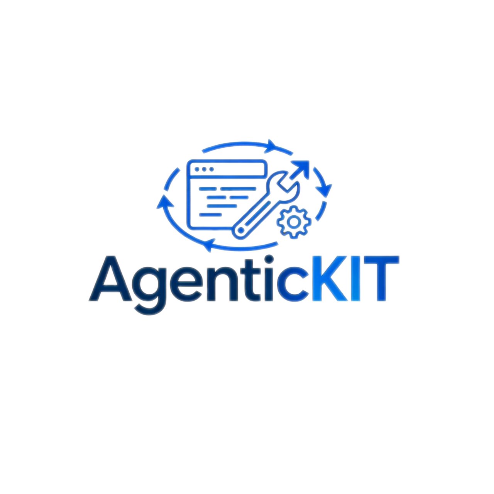

<p align="center">
  
</p>

<h1 align="center">AgenticFORGE</h1>

<h3 align="center">A TypeScript Agent Framework Driven by Tool Invocation</h3>

<p align="center">
  <a href="https://www.npmjs.com/package/@agenticforge/kit"></a>
  <a href="https://github.com/LittleBlacky/AgenticFORGE/blob/main/LICENSE"></a>
  <a href="https://github.com/LittleBlacky/AgenticFORGE"></a>
</p>

<p align="center">
  <a href="./README.zh_CN.md">??</a> | <strong>English</strong>
</p>

---

## Overview

AgenticFORGE is a TypeScript framework for building AI agents. It is centered around **tool invocation**, ships with classic agent workflows (ReAct, Plan-and-Solve, Reflection, FunctionCall), a composable multi-type memory system, and a built-in RAG pipeline.

---

## Features

- **Tool-driven**: Unified `Tool` / `ToolRegistry` / `ToolChain` abstractions with sync/async support, parameter validation, and chaining
- **Classic agent workflows**: ReAct, Plan-and-Solve, Reflection, FunctionCall, and SimpleAgent ??ready to use
- **Multi-layer memory**: Working, episodic, semantic, and perceptual memory types under a single manager
- **Pluggable storage**: KV / vector / graph / blob backends ??in-memory, Qdrant, Neo4j, or custom
- **Built-in tools**: Search, memory, notes, RAG, and terminal tools included
- **Context management**: Token-aware context builder for precise LLM input window control
- **Full type safety**: Complete TypeScript declarations, strict-mode compatible

---

## Packages

| Package | Description |
|---------|-------------|
| [`@agenticforge/core`](packages/core) | Core types, LLM client, message structures |
| [`@agenticforge/tools`](packages/tools) | Tool abstraction, ToolRegistry, ToolChain, AsyncToolExecutor |
| [`@agenticforge/agents`](packages/agents) | ReAct / Plan-Solve / Reflection / FunctionCall / Simple Agent |
| [`@agenticforge/memory`](packages/memory) | Multi-type memory manager, RAG pipeline, storage adapters |
| [`@agenticforge/tools-builtin`](packages/tools-builtin) | Built-in tools: search, memory, notes, RAG, terminal |
| [`@agenticforge/context`](packages/context) | Token-aware context builder |
| [`@agenticforge/utils`](packages/utils) | LRU cache, prompt utilities, and more |
| [`@agenticforge/kit`](packages/kit) | All-in-one entry point ??re-exports everything |

---

## Installation

```bash
# All-in-one (recommended)
npm install @agenticforge/kit
# or
pnpm add @agenticforge/kit
```

Install individual packages as needed:

```bash
npm install @agenticforge/core @agenticforge/tools @agenticforge/agents
```

---

## Quick Start

### 1. FunctionCall Agent with a custom tool

```ts
import {FunctionCallAgent, LLMClient, Tool, toolAction} from "@agenticforge/kit";
import {z} from "zod";

const weatherTool = new Tool({
  name: "get_weather",
  description: "Get the current weather for a city",
  parameters: [
    {name: "city", type: "string", description: "City name", required: true},
  ],
  action: toolAction(z.object({city: z.string()}), async ({city}) => {
    return `${city}: sunny, 25°C`;
  }),
});

const llm = new LLMClient({provider: "openai", model: "gpt-4o"});
const agent = new FunctionCallAgent({llm, tools: [weatherTool]});

const result = await agent.run("What is the weather like in Tokyo?");
console.log(result);
```

### 2. Memory system

```ts
import {MemoryManager} from "@agenticforge/kit";

const memory = new MemoryManager({
  enableWorking: true,
  enableEpisodic: true,
  enableSemantic: true,
});

await memory.addMemory({
  content: "User prefers dark theme, font size 16px",
  memoryType: "semantic",
  importance: 0.8,
});

const results = await memory.retrieveMemories({
  query: "UI preferences",
  limit: 3,
  memoryTypes: ["semantic"],
});

console.log(results.map((r) => r.content));
```

### 3. Connect to a vector database (Qdrant)

```ts
import {MemoryManager} from "@agenticforge/kit";

const memory = new MemoryManager({
  enableSemantic: true,
  adapterConfigs: [
    {type: "vectorStore", backend: "qdrant", options: {url: "http://localhost:6333"}},
    {type: "graphStore", backend: "neo4j", options: {
      url: "bolt://localhost:7687",
      username: "neo4j",
      password: "password",
    }},
  ],
});

await memory.initialize();
```

---

## Agent Types

| Agent | Best For |
|-------|----------|
| `SimpleAgent` | Single-turn or multi-turn conversation, no tools |
| `FunctionCallAgent` | Tool-driven task execution |
| `ReActAgent` | Reasoning-action loops for complex tasks |
| `PlanSolveAgent` | Plan first, then execute step by step |
| `ReflectionAgent` | Self-critique for high-quality generation |

---

## Local Development

```bash
git clone https://github.com/LittleBlacky/AgenticFORGE.git
cd AgenticFORGE

pnpm install
pnpm -r run build
pnpm -r run typecheck

# Optional: start Qdrant + Neo4j
docker compose up -d
```

---

## Contributing

Contributions are welcome. Please open an issue or pull request to discuss your changes.

---

## License

[MIT](LICENSE) © LittleBlacky
