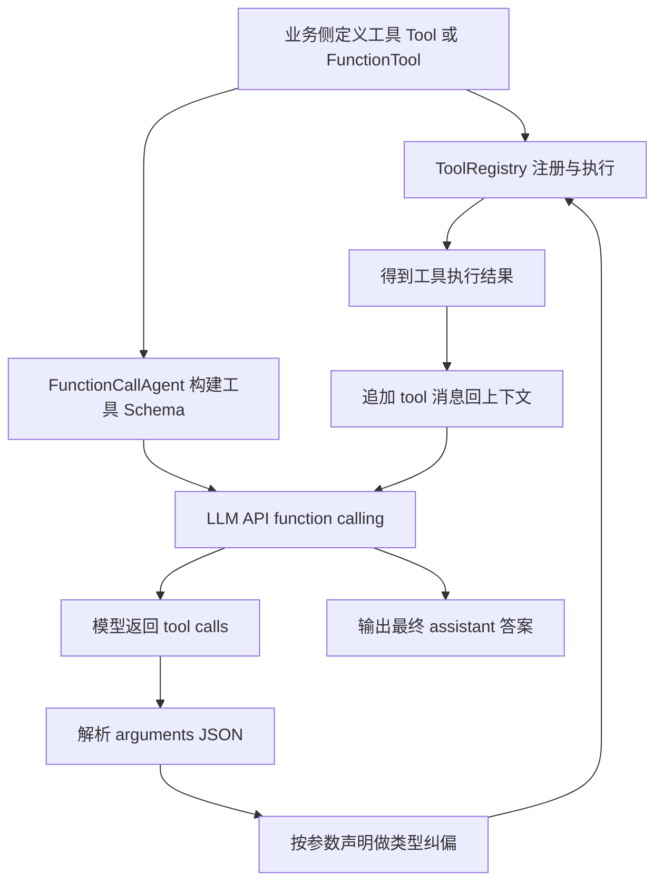

# FunctionCallAgent 设计文档

## 1. 设计目标

`FunctionCallAgent` 的目标是把「普通对话 Agent」升级为「可调用工具完成任务的 Agent」，并保持与项目现有 `Agent` 基类的一致性。

核心诉求：

1. **统一接口**：沿用 `Agent` 的 `run/history/config` 机制。
2. **可插拔工具**：支持 `ToolRegistry` 注入，也支持直接传 `tools`。
3. **兼容不同工具形态**：既支持 `Tool` 类工具，也支持 `FunctionTool` 函数工具。
4. **控制调用风险**：通过 `maxToolIterations` 限制工具调用轮次，防止死循环。
5. **故障可恢复**：工具参数解析失败、工具执行异常时，不让流程直接崩溃。

---

## 2. 模块位置与依赖

文件：`src/agent/function-call-agent/FunctionCallAgent.ts`

依赖关系：

- `Agent`：提供统一 agent 生命周期、配置、消息历史。
- `Message`：用于将用户输入与最终输出写入 history。
- `Tool / FunctionTool / OpenAIFunctionSchema`：工具抽象与 schema 描述。
- `ToolRegistry`：工具注册、查找、执行中心。
- `zod`：函数工具 schema 转 JSON Schema。

---

## 3. 对外 API 设计

### 3.1 构造参数

```ts
new FunctionCallAgent({
  name,
  llm,
  systemPrompt?,
  config?,
  toolRegistry?,
  tools?,
  enableToolCalling?,
  defaultToolChoice?,
  maxToolIterations?,
})
```

关键点：

- 若传 `toolRegistry`，优先使用外部 registry。
- 否则若传 `tools`，内部创建一个 `ToolRegistry` 并注册。
- `enableToolCalling` 最终还受 `toolRegistry` 是否存在影响：
  - 即使传 `enableToolCalling: true`，但没有工具时也不会启用工具调用。

### 3.2 运行方法

- `run(inputText, options?) => Promise<string>`：主入口。
- `streamRun(inputText, options?) => AsyncGenerator<string>`：当前为兼容接口，内部调用 `run` 后一次性产出。

### 3.3 工具管理方法

- `addTool(tool)`
- `removeTool(toolName)`
- `listTools()`
- `hasTools()`

---

## 4. 内部核心设计

## 4.1 系统提示词组装：`getSystemPrompt()`

设计思路：

1. 先取 `systemPrompt`，没有则使用默认“可靠助手”提示。
2. 若未启用工具或无工具，直接返回基础提示。
3. 若有工具，则追加“可用工具说明 + 调用策略提示”。

价值：

- 让模型在首轮就知道可调用哪些函数。
- 不强制调用工具，保留模型自决空间（“需要时调用”）。

---

## 4.2 工具 schema 生成：`buildToolSchemas()`

该方法把项目内工具定义转成 OpenAI Function Calling 所需结构。

### A. `Tool` 类工具

直接调用 `tool.toOpenAISchema()`，输出标准函数 schema。

### B. `FunctionTool` 函数工具

- 默认 schema 为：
  - object
  - `input: string` 必填
- 若 `fnTool.schema` 存在：
  - 使用 `z.toJSONSchema(schema)` 转换。
  - 转换失败时回退默认 schema，避免中断主流程。

设计取舍：

- 把“schema 精度”与“可用性”平衡：宁可降级为默认输入，也不因 schema 转换异常导致 agent 不可用。

### 4.2.1 `OpenAIFunctionSchema` 与当前项目的差异、兼容方案与结果

这一节按一条完整链路来讲：**先看差异点 -> 再看如何兼容 -> 最后看兼容后的效果**。

#### A. 差异点：`OpenAIFunctionSchema` 与项目内部工具抽象有什么不同

`OpenAIFunctionSchema` 是模型 API 侧的“协议格式”，强调结构化声明；而当前项目工具体系是“工程抽象”，强调开发体验和可扩展性。两者主要差异如下：

1. **数据形态不同**
   - OpenAI 侧：固定协议 `tools: [{ type: "function", function: { name, description, parameters } }]`
   - 项目侧：
     - `Tool`（类）通过 `getParameters()` 返回 `ToolParameter[]`
     - `FunctionTool`（函数）可选带 `zod schema`

2. **参数描述方式不同**
   - OpenAI 侧：严格 JSON Schema（`properties/required/type`）
   - 项目侧：
     - `Tool` 用 `ToolParameter` 扁平描述参数（含 default、required）
     - `FunctionTool` 可能没有 schema，仅有 `func(args)`

3. **执行入口不同**
   - OpenAI 侧：只负责“建议调用哪个函数 + 给参数 JSON 字符串”
   - 项目侧：由 `ToolRegistry.execute(toolName, args)` 负责真实执行

4. **错误处理语义不同**
   - OpenAI 侧：只返回模型消息，无法直接执行本地工具
   - 项目侧：需要处理参数解析失败、类型不匹配、工具异常等工程问题

结论：两边关注点不一样，不能直接互用，必须有一层协议适配。

#### B. 如何兼容：项目里采用的适配链路

兼容的核心在 `FunctionCallAgent`，它把“工程抽象”转换为“协议抽象”，再把协议返回映射回执行抽象。

##### 第 1 步：声明侧兼容（内部工具 -> `OpenAIFunctionSchema[]`）

入口：`buildToolSchemas()`

- 对 `Tool`：调用 `tool.toOpenAISchema()` 直接得到协议结构
- 对 `FunctionTool`：
  - 若有 `zod schema`：`z.toJSONSchema(fnTool.schema)` 生成 parameters
  - 若无 schema 或转换失败：降级为默认入参结构（`input: string`）

这一步的目标是：无论工具原始形态如何，发给模型前都统一成标准 function schema。

##### 第 2 步：决策侧兼容（模型决定调用）

模型收到统一 schema 后，会返回：

- 要调用的函数名：`tool_calls[].function.name`
- 参数字符串：`tool_calls[].function.arguments`

也就是说，模型只负责“计划调用”，并不负责实际执行。

##### 第 3 步：执行侧兼容（协议参数 -> 项目执行参数）

入口链路：

1. `parseFunctionCallArguments(argumentsText)`：把 arguments 从 JSON 字符串解析成对象（失败时兜底 `{}`）
2. `convertParameterTypes(toolName, parameters)`：按工具参数定义做类型纠偏（number/integer/boolean）
3. `toolRegistry.execute(toolName, args)`：走项目统一执行入口

这一步把“协议世界”重新映射回“工程世界”。

##### 第 4 步：反馈侧兼容（执行结果 -> 模型上下文）

工具执行结果不会直接结束流程，而是作为 `role: tool` 消息回填到会话中，再交给模型继续推理，直到：

- 模型输出最终答案（无新 tool_calls），或
- 达到 `maxToolIterations`，触发 `tool_choice: "none"` 强制收尾

这保证了 function calling 形成闭环，而不是单次调用。

#### C. 兼容后的结果：现在系统获得了什么

通过这层兼容，当前架构达成了三个结果：

1. **工具定义自由度保留**
   - 业务可继续用 `Tool` 或 `FunctionTool` 开发，不需要直接写 OpenAI 协议细节。

2. **模型调用协议统一**
   - 模型侧永远看到标准 `OpenAIFunctionSchema`，减少模型行为不确定性。

3. **运行时稳定性提升**
   - 有参数解析兜底、类型纠偏、执行异常文本化反馈、最大迭代与强制收尾，能显著降低“卡死/崩溃/无结果”概率。

可把这条链路概括为：

- **差异**：工程抽象 ≠ 协议抽象
- **兼容**：FunctionCallAgent 做双向适配（声明上行 + 执行下行）
- **结果**：既保留项目可扩展性，又满足模型 function calling 契约，端到端可用且更稳。

### 4.2.2 架构分层图（Mermaid）



图中可以看到两条关键链路：

1. **声明链路（上行）**：内部工具定义 → schema 归一化 → 模型可理解的 function 声明；
2. **执行链路（下行）**：模型 tool_calls → 参数解析/纠偏 → registry 执行 → 结果回填模型。

两条链路共同保证了“内部抽象灵活性”和“外部协议一致性”可以同时成立。

---

## 4.3 消息内容提取：`extractMessageContent(rawContent)`

由于模型返回的 `message.content` 可能是：

- string
- 多段数组（例如包含 text 片段）
- null/undefined

该方法统一转为字符串，保证后续处理一致。

---

## 4.4 工具参数处理

### A. 参数 JSON 解析：`parseFunctionCallArguments(argumentsText)`

- 尝试 `JSON.parse`
- 仅接受 object 类型
- 解析失败回空对象 `{}`

目的：避免单次坏参数直接抛异常终止对话链。

### B. 参数类型转换：`convertParameterTypes(toolName, parameters)`

根据工具参数元数据做弱类型到目标类型转换：

- `number`：字符串转 `parseFloat`
- `integer`：字符串转 `parseInt`
- `boolean`：支持 `"true"/"1"/"yes"` 等
- 其他类型透传

为什么要做：

- 模型函数参数常以字符串形式返回。
- 预转换可显著降低工具执行失败率。

---

## 4.5 工具执行封装：`executeToolCall(toolName, args)`

职责：

1. 检查 registry 是否存在；
2. 进行参数类型转换；
3. 调用 `toolRegistry.execute`；
4. 捕获错误并返回错误文本（而不是 throw）。

这样可以让错误作为“工具 observation”回到模型，模型有机会自我修复下一步调用。

---

## 4.6 底层调用：`invokeWithTools(...)`

当前实现通过 `(this.llm as any).client/model` 直接访问 OpenAI SDK 做 `chat.completions.create`，并传入：

- `messages`
- `tools`
- `tool_choice`
- `temperature`

说明：

- 这是一个工程层面的“能力补位”实现，绕过了 `LLMClient` 当前只暴露 `think/streamThink` 的限制。
- 后续建议把“带 tools 的调用”上移到 `LLMClient`，消除 `any` 依赖（见第 9 节）。

---

## 5. `run` 主流程（时序）

可以抽象为以下状态机：

1. **初始化消息上下文**
   - system prompt
   - 既有 history
   - 当前 user 输入

2. **无工具分支**
   - 直接 `llm.think`
   - 写入 history 并返回

3. **有工具分支（迭代）**
   - 调用模型（带 tools）
   - 若返回 `tool_calls`：
     - 把 assistant 消息（含 tool_calls）写入上下文
     - 逐个执行工具
     - 追加 tool 消息（`role: tool`）
     - 进入下一轮
   - 若无 `tool_calls`：
     - 取 content 作为最终答案
     - 结束循环

4. **迭代上限兜底**
   - 若达到 `maxToolIterations` 仍无最终答案：
   - 再发一次 `tool_choice: "none"` 强制模型总结

5. **落库 history**
   - 只把本轮 user + final assistant 写入 agent history。

---

## 6. 关键可靠性设计

1. **最大迭代限制**：避免无休止工具调用。
2. **强制收尾机制**：上限后禁用工具，要求模型直接回答。
3. **参数弱解析 + 类型纠偏**：降低函数参数不规范导致的失败。
4. **执行错误文本化**：错误进入上下文，让模型可自修复。
5. **schema 转换失败降级**：保障整体功能可用。

---

## 7. 与 Python 版本对齐说明

对齐点：

- 都采用“模型决策 -> 工具执行 -> 结果回填 -> 再次决策”的循环。
- 都支持多轮工具调用并有上限控制。
- 都把工具结果作为上下文反馈给模型继续推理。

结合本项目的适配点：

- 继承 `Agent` 统一框架。
- 使用 `ToolRegistry` 复用工具生态。
- 对接项目 `Message/history/config` 机制。

---

## 8. 已知边界与风险

1. **对 `LLMClient` 的内部字段依赖（`as any`）**
   - 当前代码依赖 `client/model` 私有实现细节。

2. **`streamRun` 仍是“伪流式”**
   - 当前是 `run` 完成后一次性 `yield`。

3. **history 写入粒度较粗**
   - agent history 目前不记录中间 tool steps，仅记录最终问答对。

4. **类型转换规则仍是启发式**
   - 复杂嵌套对象、数组元素类型未做深层转换。

---

## 9. 建议的后续演进

### P1（优先）

1. 在 `LLMClient` 增加正式方法：
   - `chatWithTools({messages, tools, toolChoice, temperature})`
   - 消除 `FunctionCallAgent` 中 `as any` 访问。

2. 补单元测试：
   - 工具 schema 构建
   - 参数解析失败兜底
   - 达到迭代上限后的 `tool_choice: none` 收尾

### P2（增强）

3. 提供可选的“中间步骤记录”模式：
   - 把 assistant(tool_call)/tool(observation) 也写入 history。

4. 扩展参数转换：
   - 对 array/object 递归做 schema-aware 转换。

### P3（体验）

5. 实现真正流式 `streamRun`：
   - 输出中间 thought/tool logs（或事件流）
   - 提升调试与交互体验。

---

## 10. 总结

`FunctionCallAgent` 当前版本完成了一个可用、可扩展、与项目架构一致的函数调用闭环：

- 能调工具
- 能多轮迭代
- 有上限控制
- 有失败兜底

它已经可以作为项目中“需要外部动作能力”的通用 Agent 基座。下一步重点是把底层工具调用能力正式下沉到 `LLMClient`，并补齐测试与流式体验。