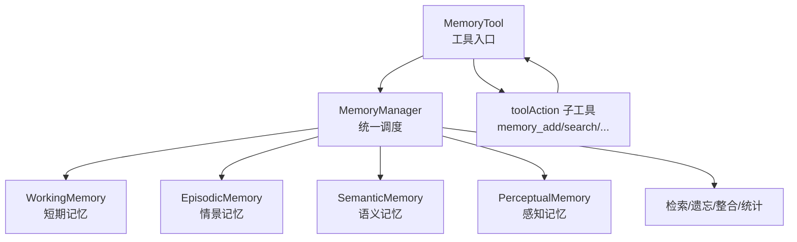

# MemoryManager 详细解析文档

## 一、背景与定位

`MemoryManager` 是记忆系统的“核心调度层”，职责介于 **MemoryTool（工具入口）** 与 **各类 Memory 实现（工作/情景/语义/感知）** 之间：

- 对外提供统一 API（增、删、改、查、遗忘、整合、统计）
- 对内分发到具体记忆类型实例（Working/Episodic/Semantic/Perceptual）
- 负责记忆类型分类与重要性评估

文件位置：`src/memory/manager.ts`

---

## 二、核心依赖与结构

### 1) 依赖

- `MemoryConfig / MemoryItem / MemoryType`：基础类型与配置
- `WorkingMemory / EpisodicMemory / SemanticMemory / PerceptualMemory`：四类记忆实现
- `randomUUID`：生成全局唯一 id

### 2) 关键字段

- `config: MemoryConfig`：融合默认配置与用户配置
- `userId: string`：当前用户身份隔离
- `memoryTypes: Partial<Record<MemoryType, ManagedMemory>>`：启用的记忆类型映射

---

## 三、构造与初始化流程

### 3.1 配置合并

```ts
this.config = {
  ...DEFAULT_CONFIG,
  ...(options?.config ?? {}),
};
```

- 默认配置来自 `DEFAULT_MEMORY_CONFIG`
- 构造参数可覆盖任意字段

### 3.2 记忆类型启用

```ts
if (options?.enableWorking ?? true) this.memoryTypes.working = new WorkingMemory(this.config)
```

- 默认启用 `working/episodic/semantic`
- 默认关闭 `perceptual`
- 可通过构造参数按需启用

---

## 四、核心能力逐段解析

### 4.1 添加记忆：`addMemory(options)`

流程：

1. **确定类型**
   - `autoClassify = true` 时调用 `classifyMemoryType(...)`
   - 否则使用显式 `memoryType`

2. **确定重要性**
   - 若外部传入，则使用该值
   - 否则根据内容与元信息自动评估（`calculateImportance`）

3. **构建 MemoryItem**
   - `id`：`randomUUID()`，失败时回退 `mem_${timestamp}_${rand}`
   - `userId`：用于多用户隔离
   - `timestamp`：当前时间

4. **写入对应 Memory 实例**
   - `memory.add(item)`

特点：

- 自动分类 + 自动重要性计算，降低调用方负担
- 支持显式禁用 autoClassify

### 4.2 检索记忆：`retrieveMemories(options)`

流程：

1. 确定检索类型集合（默认所有已启用类型）
2. 计算 `perTypeLimit`：把 `limit` 均分到各类型
3. 对每个类型执行 `memory.retrieve(query, perTypeLimit, {userId})`
4. 对结果进行过滤：
   - 重要性过滤（`minImportance`）
   - 时间区间过滤（`timeRange`）
5. 合并、排序、截断（按重要性降序）

特点：

- 多类型并行检索（逻辑层）
- “均分 limit” 避免单类记忆挤占结果
- 使用 `userId` 做隔离

### 4.3 更新记忆：`updateMemory(options)`

- 在所有已启用 memory 类型中查找 `memoryId`
- 找到后执行 `update`
- 未找到返回 `false`

特点：跨类型透明更新。

### 4.4 删除记忆：`removeMemory(memoryId)`

- 类似 update：遍历所有类型找到并删除

### 4.5 遗忘策略：`forgetMemories(options)`

支持三种策略：

- `importance_based`
- `time_based`
- `capacity_based`

对每个支持 `forget(...)` 的记忆实例调用，累计返回遗忘条数。

### 4.6 记忆整合：`consolidateMemories(options)`

典型场景：

- 将高重要度工作记忆迁移为情景/语义记忆

流程：

1. 从 `fromType` 获取候选（`getAll()`）
2. 过滤重要性 >= `importanceThreshold`
3. 从源记忆移除
4. 迁移到目标记忆，并适当提升重要性（*1.1）

### 4.7 统计信息：`getMemoryStats()`

- 汇总每类记忆的 stats
- 计算 total count
- 返回 `enabledTypes` 与关键 config

### 4.8 清空：`clearAllMemories()`

- 对所有启用类型调用 `clear()`

---

## 五、自动分类与重要性评估

### 5.1 类型自动分类

`classifyMemoryType` 使用两条路径：

1. **显式标记优先**：`metadata.type` 若存在且合法，直接采用
2. **内容规则判断**：
   - `isEpisodicContent`: 时间/经历类关键词
   - `isSemanticContent`: 概念/规则类关键词
   - 否则默认 `working`

### 5.2 重要性计算

`calculateImportance` 由以下因素叠加：

- 内容长度 > 100：+0.1
- 命中关键词（重要/关键/警告...）：+0.2
- metadata.priority:
  - high: +0.3
  - low: -0.2

最后用 `clamp01` 强制限制到 [0,1] 区间。

---

## 六、设计特点与局限

### 特点

1. **多类型统一调度**：外部无需感知具体存储实现。
2. **自动化能力内置**：分类与重要性评估降低调用复杂度。
3. **可扩展性强**：新增记忆类型只需实现 Memory 接口并注入。

### 局限

1. **分类/重要性为规则式**，可能与真实语义不一致
2. **均分 perTypeLimit** 可能压制某一类更相关的记忆
3. **缺少持久化机制**，当前为内存级

---

## 七、演进建议

### P1（优先）

1. 引入嵌入向量或召回模型提升检索质量
2. `perTypeLimit` 改为“按记忆总量或相关性动态分配”
3. 增加记忆持久化存储适配层（文件/DB）

### P2（增强）

4. 重要性评估引入模型评分或学习策略
5. 增加跨类型的 rerank / fusion 逻辑

### P3（工程化）

6. 记忆生命周期治理：冷/热分层、自动压缩、归档策略

---

## 八、流程图：Tool → Manager → Memory Types



> 说明：MemoryTool 负责参数与工具协议，MemoryManager 负责调度与策略，具体 Memory 类型负责真实存取与检索。

---

## 八、总结

`MemoryManager` 承担了“统一记忆调度中心”的角色：

- 向上统一 API
- 向下解耦具体记忆类型
- 内置规则分类与重要性评估

它让记忆系统的上层工具与 Agent 逻辑保持简洁，同时为后续引入更复杂的检索/学习机制留足扩展空间。