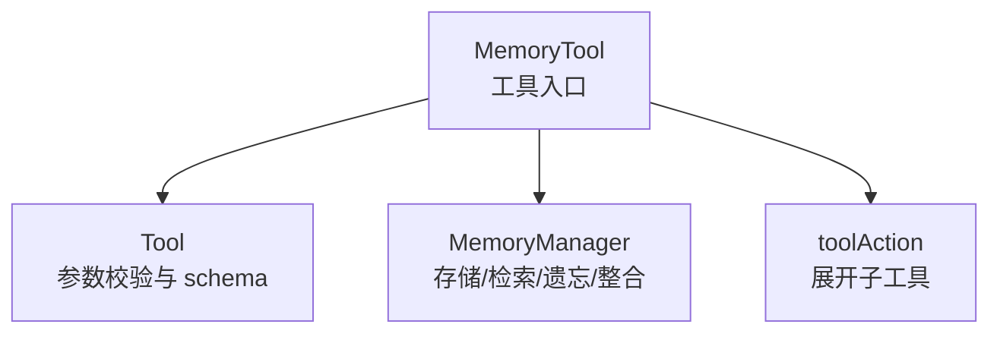

# MemoryTool 详细解析文档

## 一、背景与设计目标

`MemoryTool` 是工具体系中的“记忆入口”，对外提供统一的工具接口，对内管理 `MemoryManager`，实现：

1. **多类型记忆操作**（工作/情景/语义/感知）；
2. **工具化调用**（支持 `Tool` 与 `@toolAction` 子工具）；
3. **会话级追踪**（session_id / conversationCount）；
4. **易用且可控的管理入口**（增删改查、遗忘、整合、统计）。

文件位置：`src/tools/builtin/memory.ts`

---

## 二、核心结构与依赖

### 1) 依赖关系（图示）

### 2) 关键字段

- `memoryTypes: MemoryType[]`：启用的记忆类型集合。
- `memoryManager: MemoryManager`：记忆核心管理器实例。
- `currentSessionId: string | null`：当前会话 id，用于分组会话记忆。
- `conversationCount: number`：对话轮次数。

---

## 三、构造与初始化流程

`constructor(options?: MemoryToolOptions)` 做了三件事：

1. **设置 Tool 元信息**
   - name: `memory`
   - description: 记忆工具描述
   - expandable: 默认 false，可通过 `options.expandable` 控制

2. **确定启用的记忆类型**
   - 默认启用 `working / episodic / semantic`
   - 可通过 `options.memoryTypes` 控制

3. **初始化 MemoryManager**
   - 透传 `memoryConfig` 与 `userId`
   - 根据 `memoryTypes` 逐项开启 `enableWorking/enableEpisodic/enableSemantic/enablePerceptual`

---

## 四、Tool 统一入口：`run(parameters)`

`run` 是标准 Tool 入口，对所有操作进行统一调度。流程如下：

1. **基础参数校验**
   - 调用 `validateAndNormalizeParameters`，完成通用参数的基础校验与默认值注入。

2. **按 action 的结构化校验**
   - 读取 `action`，根据 action 选择对应的结构化 schema 进行二次校验。
   - 若缺失必填字段（如 `add` 的 `content`、`update` 的 `memory_id`），直接返回错误。

3. **读取 action 并分发**
   - 支持 action：
     - `add/search/summary/stats/update/remove/forget/consolidate/clear_all`
   - 使用 `switch` 分发到具体方法。

4. **参数清洗**
   - 通过 `toNumber / toOptionalString / toOptionalNumber / toMemoryType` 进行类型纠偏。

这种设计把“工具协议入口”与“业务操作”解耦，便于复用与测试。

---

## 五、参数定义：`getParameters()`

`getParameters` 定义了完整的工具协议参数（供 Tool schema 与 function calling 使用）：

- `action`：必填
- `content/query/memory_type/importance/limit/...`：按操作选择性使用

关键点：

- 所有参数都有默认值，降低模型调用失败率
- 数值型参数定义为 `number`，配合 `Tool` 自带的 zod runtime schema 自动转换

---

## 六、核心能力拆解（结合代码）

### 6.1 添加记忆：`addMemory(...)`

流程：

1. 若 `currentSessionId` 为空，生成新的 session id（时间戳）
2. 构建 `metadata`：包含 `session_id` 与 `timestamp`
3. 若是感知记忆（`perceptual`），补充 `raw_data` 与 `modality`
4. 调用 `memoryManager.addMemory(...)`

特点：

- 自动会话分组
- 支持感知记忆文件路径与模态推断

### 6.2 搜索记忆：`searchMemory(...)`

流程：

1. 将 `memoryType` 转为合法枚举
2. 调用 `memoryManager.retrieveMemories({query, limit, memoryTypes, minImportance})`
3. 格式化结果并返回

特点：

- 支持最小重要性过滤
- 返回带类型标签与重要性评分的结果列表

### 6.3 记忆摘要：`getSummary(...)`

流程：

1. 获取 `memoryManager.getMemoryStats()`
2. 输出总量、会话信息、类型分布
3. 再获取重要记忆（importance >= 0.5）并展示前 N 条

特点：

- 兼顾统计概览 + 关键内容列表

### 6.4 统计信息：`getStats()`

直接读取 `getMemoryStats` 并格式化输出：

- 总记忆数
- 启用的记忆类型
- 当前会话与对话轮次

### 6.5 更新/删除

- `updateMemory(memoryId, content, importance)`：更新记忆
- `removeMemory(memoryId)`：删除记忆

特点：

- 如果没有传 `memory_id` 会直接报错
- 若找不到目标则返回“未找到”提示

### 6.6 遗忘：`forget(...)`

调用 `memoryManager.forgetMemories`，支持三类策略：

- `importance_based`
- `time_based`
- `capacity_based`

并返回遗忘条数。

### 6.7 整合：`consolidate(...)`

调用 `memoryManager.consolidateMemories`，用于把高重要度记忆从短期迁移到长期：

- `fromType` 默认为 `working`
- `toType` 默认为 `episodic`
- `importanceThreshold` 控制迁移门槛

### 6.8 清空：`clearAll()`

调用 `memoryManager.clearAllMemories()` 清空所有记忆。

---

## 七、自动记录与便捷能力

### 7.1 自动记录对话

`autoRecordConversation(userInput, agentResponse)`：

- 每轮对话都会写两条 `working` 记忆（用户/助手）
- 若输入或回复包含“重要/记住”或长度较大，会额外写入 `episodic` 记忆

### 7.2 快捷 API

- `addKnowledge(content, importance)`：快速写语义记忆
- `getContextForQuery(query, limit)`：把检索结果拼成 context 文本
- `clearSession()`：清除会话状态并清空记忆
- `forgetOldMemories(maxAgeDays)`：按时间策略遗忘

这些方法不暴露为 tool action，但提供给上层业务直接调用。

---

## 八、可展开子工具（@toolAction）

`MemoryTool` 标记了多个 `@toolAction`：

- `memory_add` / `memory_search` / `memory_summary` / `memory_stats`
- `memory_update` / `memory_remove` / `memory_forget` / `memory_consolidate`
- `memory_clear`

当 `expandable = true` 时，这些方法会被自动展开为子工具，使得模型可以直接调用更细粒度的 memory 工具。

---

## 九、类型与输入纠偏逻辑

- `toNumber / toOptionalNumber`：字符串或 number 统一转 number
- `toOptionalString`：过滤空字符串
- `toMemoryType`：非法值回退为 `working`

这些纠偏策略能显著降低 LLM 参数格式波动导致的失败率。

---

## 十、与 MemoryManager 的边界

- `MemoryTool` 负责：
  - 参数校验与路由
  - 结果格式化
  - 会话级逻辑（session_id、conversationCount）
- `MemoryManager` 负责：
  - 实际存储结构
  - 检索/遗忘/整合策略
  - 统计信息

职责清晰，减少耦合。

---

## 十一、优势与局限

### 优势

1. 统一工具入口，便于 Agent 调用
2. 支持多类型记忆与高级操作（遗忘/整合）
3. 支持子工具展开，便于 function calling
4. 自动对话记忆与快捷 API 提升可用性

### 局限

1. `run` 中 action 与参数组合仍是约定式，缺少更强 schema 约束
2. 自动记录策略较简单，容易产生“噪声记忆”
3. `conversationCount` 未与外部对话管理打通

---

## 十二、演进建议

### P1（优先）

1. 增加结构化 schema（按 action 分层）
2. 为 `autoRecordConversation` 增加可配置规则

### P2（增强）

3. 引入记忆去重/合并逻辑
4. 为 `memory_search` 引入 rerank 或 embedding 相似度

### P3（工程化）

5. 提供持久化存储适配（文件/DB）
6. 添加 telemetry（命中率、遗忘比例、召回质量）

---

## 十三、总结

`MemoryTool` 是本项目 Memory 系统的“工具层入口”，它通过统一的 `Tool` 接口封装了复杂的记忆能力，并通过子工具展开机制让模型能以更细粒度调用记忆操作。它兼顾了“可用性、易用性、扩展性”，是构建 Agent 记忆体系的关键基建模块。