# RAG 系统统一解析文档（TypeScript）

## 1. 背景与目标
本文件统一整合现有 RAG 相关文档（基础解析、存储适配层改进、完整解析等），形成一份**覆盖端到端流程、关键机制、工程化改造与演进方向**的完整说明。文档范围限定在 `src/memory/rag` 目录及其依赖的存储与 embedding 工厂。

目标：
- 统一术语与流程描述
- 明确核心数据结构与关键路径
- 覆盖 P0/P1/P2 改进项与动机
- 解释当前 RAG 工厂（向量存储工厂）的作用与使用方式

---

## 2. 目录范围与模块关系

- `src/memory/rag/pipeline.ts`：RAG 主流程（加载、切块、向量化、检索增强、重排/压缩）
- `src/memory/rag/document.ts`：通用文档模型与切分工具
- `src/memory/rag/storeFactory.ts`：RAG 向量存储工厂（默认策略 + 可注册工厂）
- `src/memory/embedding/factory.ts`：默认 embedding 工厂
- `src/memory/storage/*`：通用存储适配层（RAG 可独立于此）

---

## 3. 核心数据结构

### 3.1 RagChunk / RagChunkMetadata
RAG 的核心传输单元，承载检索所需的内容与元信息：
- `id`：chunk 唯一标识
- `content`：chunk 文本
- `metadata`：用于过滤、引用、拼接与评估的结构化数据

### 3.2 Document / DocumentChunk（通用模型）
`document.ts` 提供通用的文档抽象与分块工具，适用于纯文本处理或非 pipeline 流程。RAG 主流程当前不强依赖该模型，但两者在职责上互补。

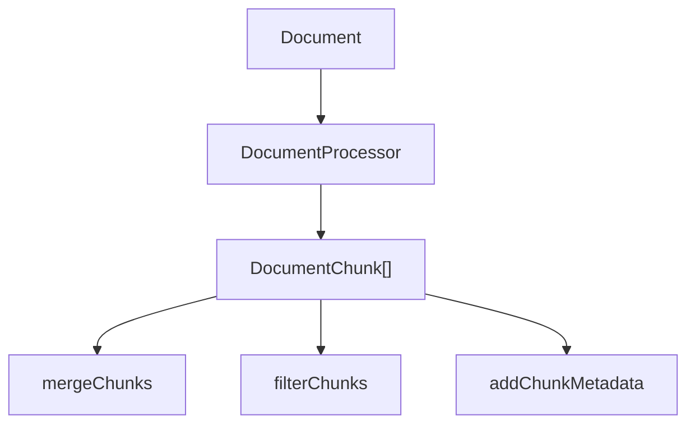

代码关键点：

```14:124:src/memory/rag/document.ts
export class Document {
  content: string;
  metadata: DocumentMetadata;
  docId: string;
}

export class DocumentChunk {
  content: string;
  metadata: DocumentMetadata;
  chunkId: string;
  docId?: string;
  chunkIndex: number;
}

export class DocumentProcessor {
  processDocument(document: Document): DocumentChunk[] {
    const chunks = this.splitText(document.content);
    // ... build chunk metadata
  }
  mergeChunks(chunks: DocumentChunk[], maxLength = 2000): DocumentChunk[] {
    // ... merge adjacent chunks
  }
}
```

#### 3.2.1 `splitText` 切分策略

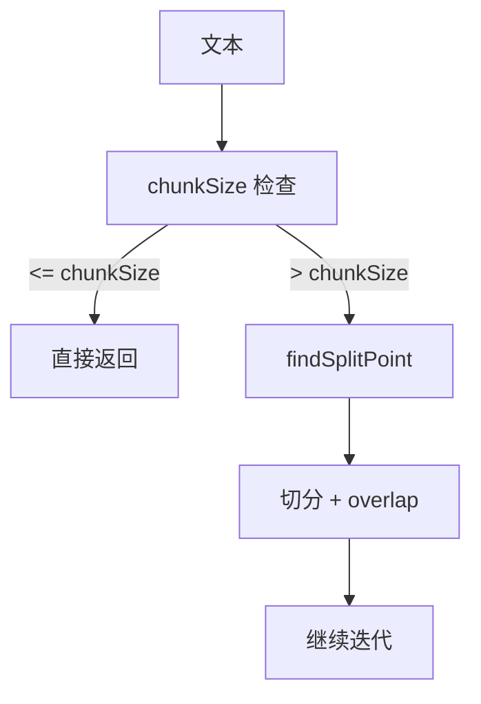

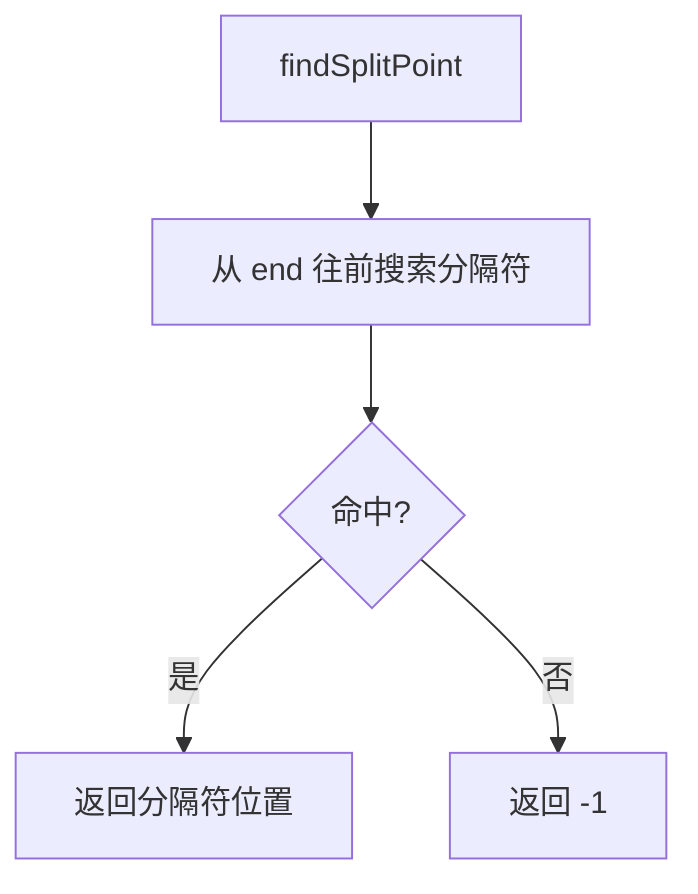

代码关键点：

```153:194:src/memory/rag/document.ts
private splitText(text: string): string[] {
  if (text.length <= this.chunkSize) {
    return [text];
  }
  // ... findSplitPoint + overlap
}
```

---

## 4. 核心流程（结合代码）

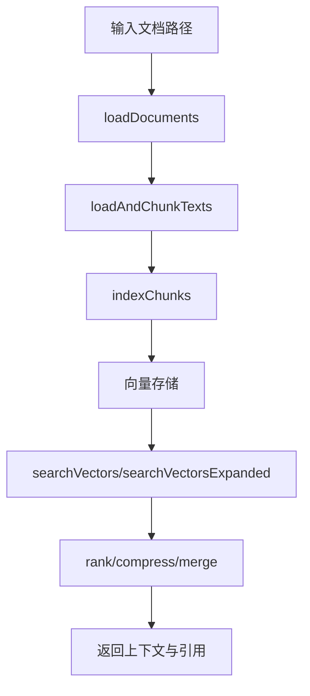

### 4.1 文档加载与预处理
入口：`loadDocuments`
- 逐个检查文件是否存在，过滤不可用路径
- 通过 `convertToMarkdown` 转换为 markdown（可注入 `markitdownAdapter`）
- `detectLang` 进行语言识别
- `splitParagraphsWithHeadings` 切段并记录 `heading_path`

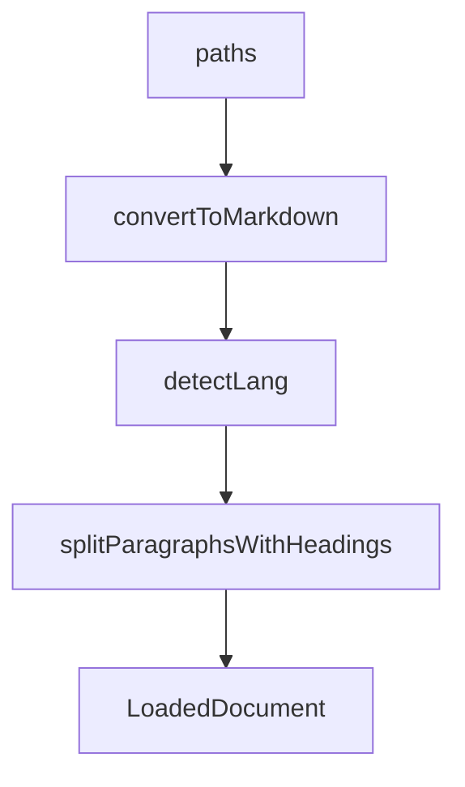

代码关键点：

```420:494:src/memory/rag/pipeline.ts
export function loadDocuments(
  options: LoadAndChunkTextsOptions,
): LoadedDocument[] {
  // ... exists check
  const markdownText = convertToMarkdown(filePath, markitdownAdapter);
  if (!markdownText.trim()) {
    continue;
  }

  const lang = detectLang(markdownText);
  const docId = md5(`${filePath}|${markdownText.length}`);
  const paragraphs = splitParagraphsWithHeadings(markdownText);
  // ... push LoadedDocument
}
```

### 4.2 文本切块
入口：`loadAndChunkTexts`
- 只负责 chunk 与去重
- `chunkParagraphs` 基于近似 token 长度切块
- 通过 `content_hash` 去重，避免相同段落重复入库

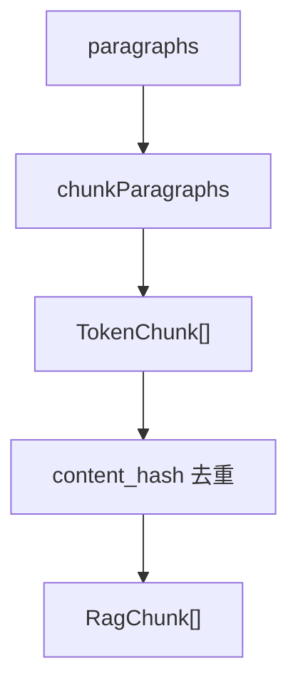

代码关键点：

```javascript 494:590:src/memory/rag/pipeline.ts
export function loadAndChunkTexts(
  options: LoadAndChunkTextsOptions,
): RagChunk[] {
  const loadedDocs = loadDocuments(options);
  // ... chunkParagraphs
  const contentHash = md5(norm);
  if (seenHashes.has(contentHash)) {
    continue;
  }
  // ... build RagChunk
}
```

### 4.3 向量化与入库
入口：`indexChunks`
- 预处理 markdown，去标题/链接/代码块，避免噪声干扰 embedding
- 分批调用 embedder（默认 batch=64），并做维度对齐
- 通过 `buildRagMetadata` 统一拼装元数据（含 `memory_type / rag_namespace / user_id`）
- 逐条写入向量库（`upsertVector`）

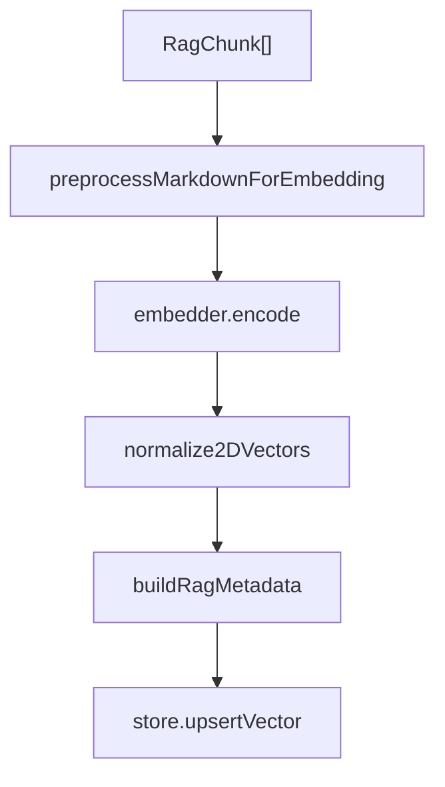

代码关键点：

```600:700:src/memory/rag/pipeline.ts
export function preprocessMarkdownForEmbedding(text: string): string {
  // ... remove headings/links/code ...
}

export async function indexChunks(options: IndexChunksOptions): Promise<void> {
  if (!options.store) {
    throw new Error("VectorStoreAdapter is required for indexChunks");
  }
  const processedTexts = chunks.map((c) =>
    preprocessMarkdownForEmbedding(c.content),
  );
  const raw = await embedder.encode(part);
  const partVecs = normalize2DVectors(raw, dimension, part.length);
  metadata.push(buildRagMetadata(ch, ragNamespace, ragUserId));
  await store.upsertVector({id: ids[i], vector: vectors[i], payload: metadata[i]});
}
```

### 4.4 检索与扩展
- `searchVectors`：基础向量检索
- `searchVectorsExpanded`：支持 MQE/HyDE 扩展查询

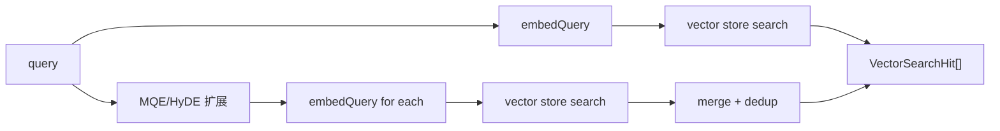

#### 4.4.1 基础检索：`searchVectors`

关键流程：
- embedding query
- 构造过滤条件（`memory_type=rag_chunk` + `rag_namespace`）
- 调用向量库 `queryVector`

```700:786:src/memory/rag/pipeline.ts
export async function searchVectors(
  options: SearchVectorsOptions,
): Promise<VectorSearchHit[]> {
  if (!options.store) {
    throw new Error("VectorStoreAdapter is required for searchVectors");
  }
  const queryVector = await embedQuery(query, options.embedder, dimension);
  const where: Record<string, unknown> = {memory_type: "rag_chunk"};
  // ... filter by rag_namespace
  const rawHits = await store.queryVector({vector: queryVector, limit: topK, filter: where});
  return rawHits.filter(...).map(...);
}
```

#### 4.4.2 扩展检索：`searchVectorsExpanded`

关键流程：
- MQE：`promptMqe` 生成多样化 query
- HyDE：`promptHyde` 生成“假设答案” query
- 多 query 并行召回 → 取最高分去重

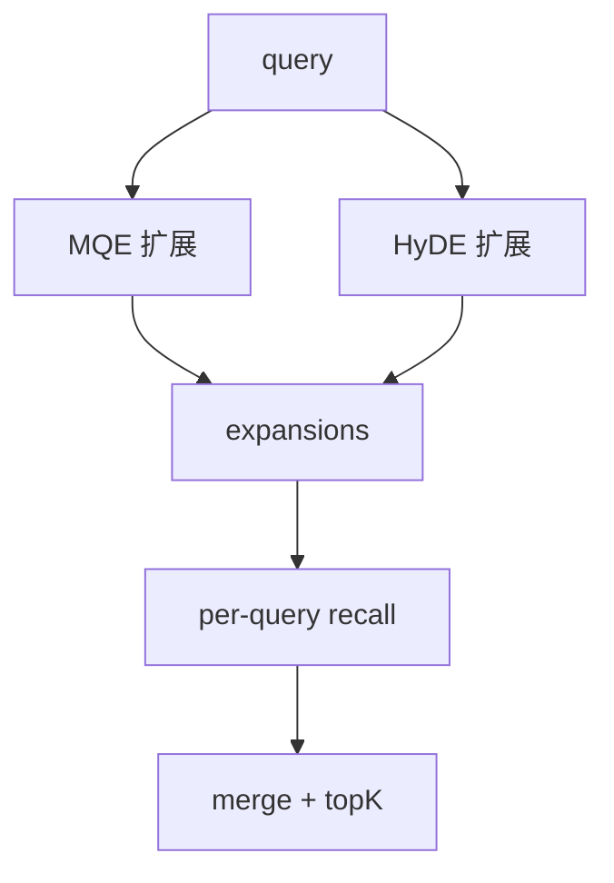

```820:904:src/memory/rag/pipeline.ts
export async function searchVectorsExpanded(
  options: SearchVectorsExpandedOptions,
): Promise<VectorSearchHit[]> {
  if (!options.store) {
    throw new Error("VectorStoreAdapter is required for searchVectorsExpanded");
  }
  if (enableMqe) expansions.push(...await promptMqe(...));
  if (enableHyde) expansions.push(hyde);
  const uniq = [...new Set(expansions.filter(Boolean))];
  // ... per-query recall + merge
}
```

### 4.5 排序与压缩
- `rank`：融合向量分数与图信号
- `compressRankedItems`：同文档片段压缩
- `mergeSnippetsGrouped`：按文档分组拼接并生成引用

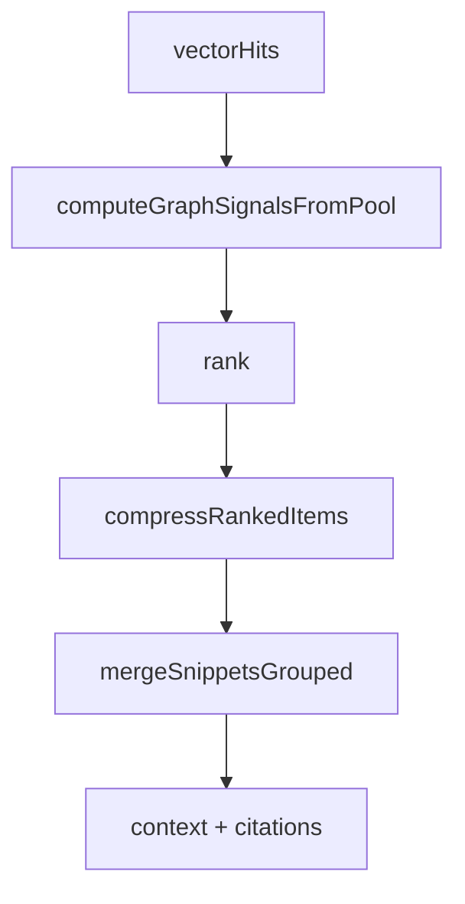

代码关键点：

```980:1062:src/memory/rag/pipeline.ts
export function rank(
  vectorHits: VectorSearchHit[],
  graphSignals: Record<string, number> = {},
  wVector = 0.7,
  wGraph = 0.3,
): Array<Record<string, unknown>> {
  // ... score = wVector * v + wGraph * g
}
```

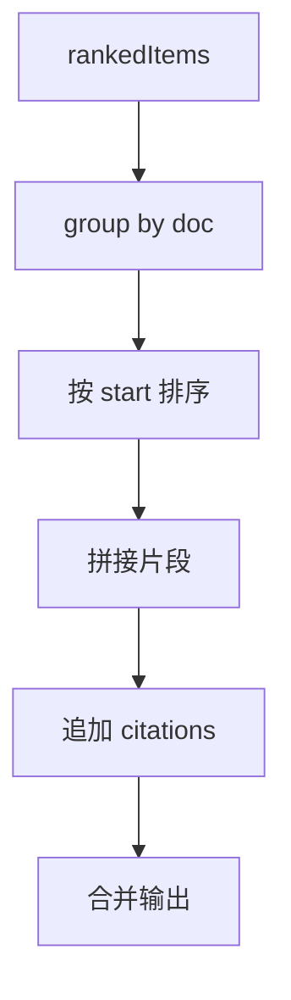

```1126:1198:src/memory/rag/pipeline.ts
export function mergeSnippetsGrouped(
  rankedItems: Array<Record<string, unknown>>,
  maxChars = 1200,
  includeCitations = true,
): string {
  // ... group by doc, append citations
}
```

```1230:1312:src/memory/rag/pipeline.ts
export function compressRankedItems(
  rankedItems: Array<Record<string, unknown>>,
  enableCompression = true,
  maxPerDoc = 2,
  joinGap = 200,
): Array<Record<string, unknown>> {
  // ... merge adjacent chunks
}
```

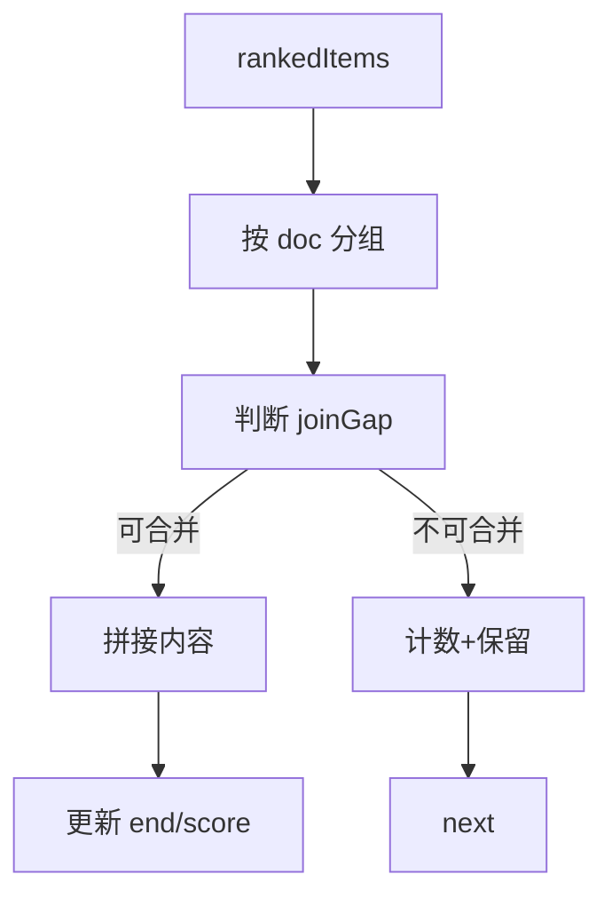

---

## 5. 关键机制与实现细节

### 5.1 元数据标准化（P1）
引入 `buildRagMetadata` 统一拼装：
- `memory_type` / `rag_namespace` / `data_source` / `user_id`
- 避免散落在多个函数内

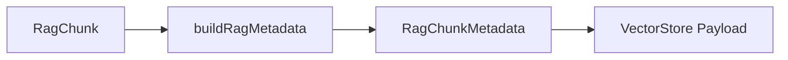

代码关键点：

```612:642:src/memory/rag/pipeline.ts
export function buildRagMetadata(
  chunk: RagChunk,
  ragNamespace = "default",
  userId = "rag_user",
): RagChunkMetadata {
  return {
    memory_id: chunk.id,
    user_id: userId,
    memory_type: "rag_chunk",
    data_source: "rag_pipeline",
    rag_namespace: ragNamespace,
    is_rag_data: true,
    ...chunk.metadata,
  };
}
```

### 5.2 查询参数收口（P0）
引入 `RagQueryOptions`，统一 `topK / scoreThreshold / enableMqe / enableHyde` 等配置。

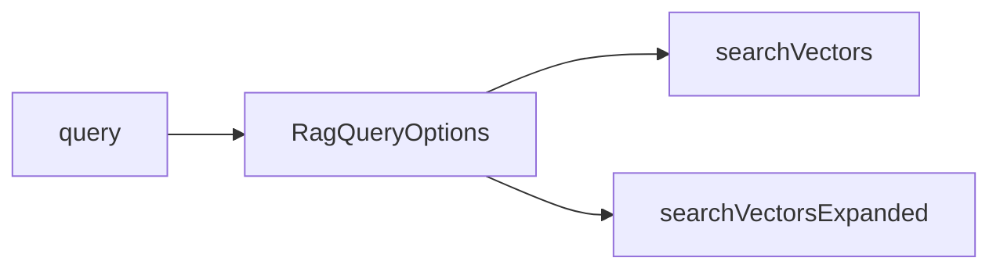

### 5.3 `ragUserId` 参数化
移除硬编码 `user_id`，允许调用层注入，支持多租户隔离。


---

## 6. RAG 向量存储工厂（storeFactory）

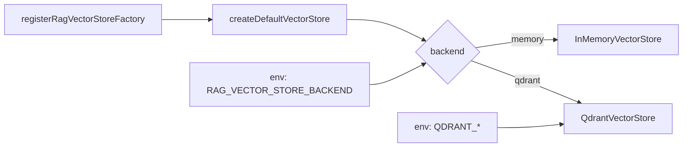

### 6.1 作用
`storeFactory.ts` 是 RAG 独立的向量存储工厂，核心目标：
- 默认策略集中管理
- 支持环境变量切换后端
- 支持注册自定义工厂以对接 DI/配置中心

### 6.2 关键能力
- `createDefaultVectorStore(options?)`
  - 默认 `memory`，支持 `qdrant`
  - 从环境变量读取默认配置
- `registerRagVectorStoreFactory(factory)`
  - 允许外部注入自定义工厂

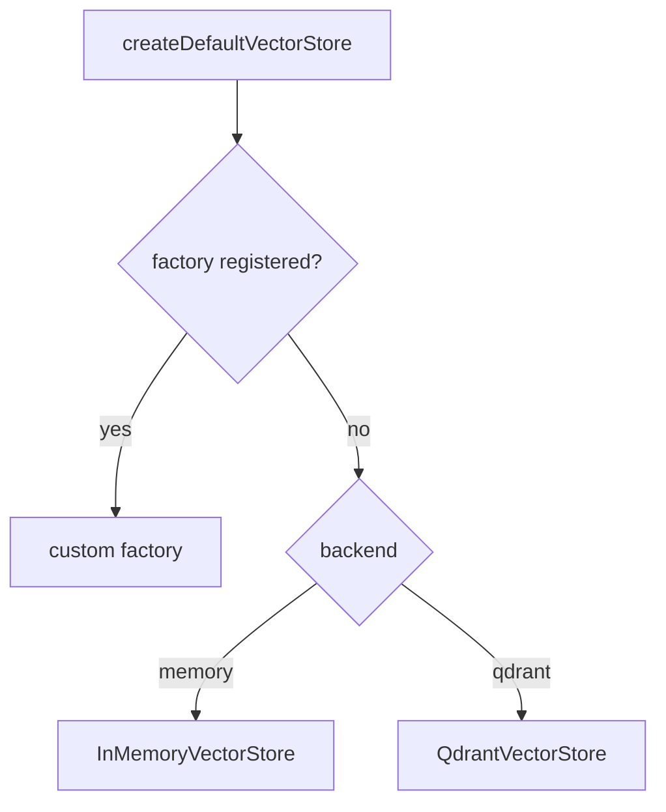

代码关键点：

```1:54:src/memory/rag/storeFactory.ts
export function createDefaultVectorStore(
  options: RagVectorStoreFactoryOptions = {},
): VectorStoreAdapter {
  if (ragVectorStoreFactory) {
    return ragVectorStoreFactory(options);
  }
  const backend = options.backend ?? process.env.RAG_VECTOR_STORE_BACKEND ?? "memory";
  if (backend === "qdrant") {
    return new QdrantVectorStore({
      url: options.qdrantUrl ?? process.env.QDRANT_URL,
      apiKey: options.qdrantApiKey ?? process.env.QDRANT_API_KEY,
      // ... collection/vectorSize/distance/timeout
    });
  }
  return new InMemoryVectorStore();
}
```

### 6.3 适用场景
- 环境切换（本地/测试/线上）
- 需要注入配置中心或 DI 容器
- 多向量库后端扩展

---

## 7. 可靠性与降级策略

- `store` 必填断言：避免隐式默认或空引用
- Embedding 工厂下沉：便于替换模型提供方
- 对 MQE/HyDE 的异常保护：失败时回退到原 query

---

## 8. 示例：从输入到检索结果

1) 输入文档路径
2) `loadDocuments` 转换与分段
3) `loadAndChunkTexts` 切块并去重
4) `indexChunks` 写入向量库
5) `searchVectorsExpanded` 执行多路召回
6) `rank + mergeSnippetsGrouped` 输出上下文 + 引用

---

## 8.5 Facade 入口：`createRagPipeline`

`createRagPipeline` 作为外部接入入口，封装完整流程：
- 统一默认值（`ragNamespace` / `ragUserId` / `dimension`）
- 创建 `store` 与 `embedder`
- 对外暴露 `addDocuments / search / searchAdvanced / getStats`

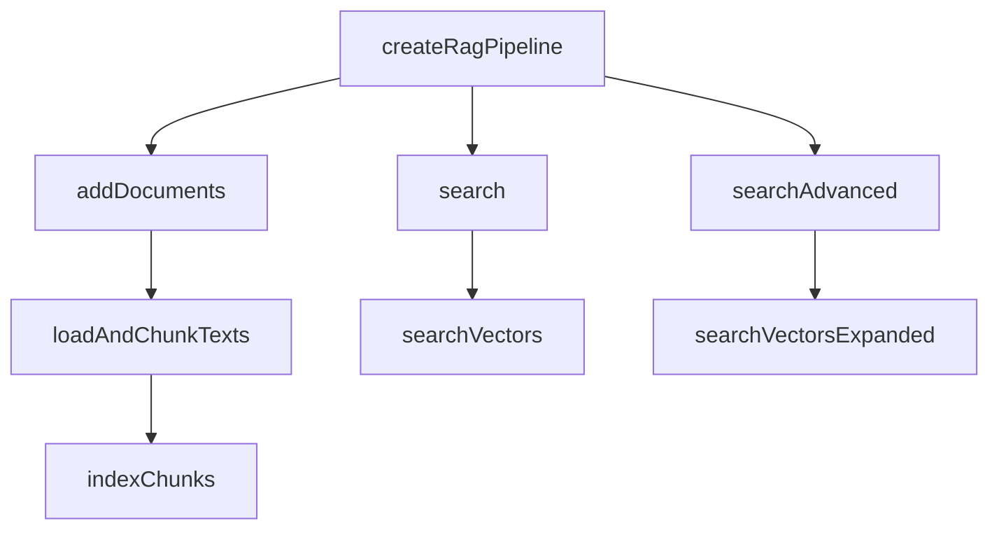

代码关键点：

```1335:1411:src/memory/rag/pipeline.ts
export function createRagPipeline(
  options: CreateRagPipelineOptions = {},
): RagPipeline {
  const ragNamespace = options.ragNamespace ?? "default";
  const ragUserId = options.ragUserId ?? "rag_user";
  const dimension = options.dimension ?? 384;
  const store = options.store ?? createDefaultVectorStore();
  const embedder = options.embedder ?? createDefaultTextEmbedder(dimension);

  const addDocuments = async (...) => {
    const chunks = loadAndChunkTexts({ ... });
    await indexChunks({store, chunks, ragNamespace, ragUserId, embedder, dimension});
  };

  const search = async (...) => searchVectors({store, query, options: {...}});
  const searchAdvanced = async (...) => searchVectorsExpanded({store, query, options: {...}});
  return {store, namespace: ragNamespace, addDocuments, search, searchAdvanced, getStats};
}
```

---

## 9. 局限与演进建议

### 9.1 已知限制
- Hash embedding 仅适合本地联调
- 语言识别为轻量规则
- RAG 与 MemoryItem 仍是两套数据结构

### 9.2 P2 演进方向
- **模型对齐**：将 `RagChunk` 映射为 `MemoryItem`
- **选项分层**：`CreateRagPipelineOptions` 拆分为 Storage/Embedding/Query

---

## 10. 小结
当前 RAG 系统已经形成**完整可运行链路**，并通过 P0/P1 改造实现了：
- 存储注入集中化
- 查询参数收口
- 元数据标准化
- 文档加载职责拆分

同时引入独立的 RAG 存储工厂，为环境配置与后端扩展提供基础。后续在模型对齐与选项分层上演进，可进一步提升一致性与可维护性。
