# Memory 系统全链路详细解析文档

## 1. 背景与目标

### 1.1 为什么需要 Memory 系统

Agent 在多轮对话与复杂任务中需要跨轮次保持上下文、积累知识、回忆历史经历。裸 LLM 调用无状态、上下文窗口有限，单靠 prompt 拼接无法应对长期交互场景。Memory 系统提供了持久化、可检索的「记忆基础设施」，让 Agent 具备与人类相似的多层次记忆能力。

### 1.2 目标与边界

- **目标**：提供统一 API，支持工作记忆、情景记忆、语义记忆、感知记忆的增删改查、遗忘与整合。
- **范围**：`src/memory/` 目录下所有模块，以及 `src/tools/builtin/memory.ts` 工具层入口。
- **边界**：不负责 LLM 调用、不管理对话 turn，仅聚焦记忆存储与检索。

---

## 2. 系统全局架构

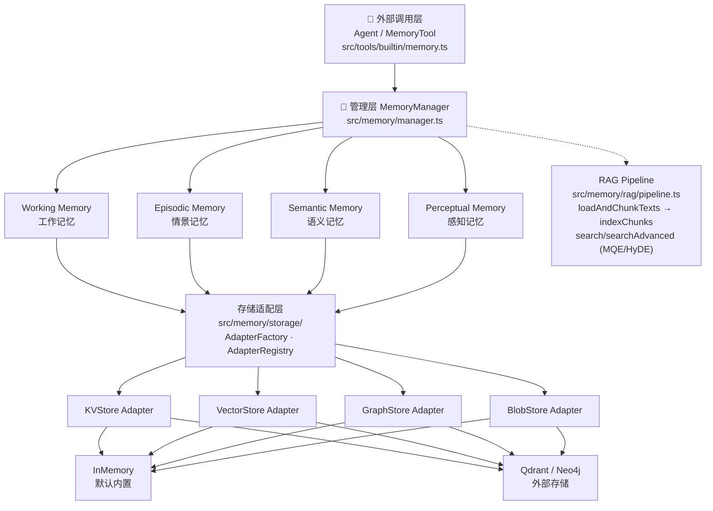

| 层级 | 职责 | 关键文件 |
|------|------|----------|
| 工具层 | 统一工具协议、参数校验、会话管理 | `tools/builtin/memory.ts` |
| 管理层 | 类型分发、跨类型检索、遗忘整合 | `memory/manager.ts` |
| 记忆类型层 | 各类型存储语义与检索策略 | `memory/types/*.ts` |
| 存储适配层 | 存储后端抽象与切换 | `memory/storage/*.ts` |
| RAG 模块 | 文档加载、切块、检索增强 | `memory/rag/pipeline.ts` |

> 相关详解：`docs/16-RAG系统完整解析.md`

---

## 3. 核心数据结构

### 3.1 MemoryItem — 统一记忆条目

`MemoryItem` 是贯穿全链路的统一数据载体，定义于 `src/memory/types/base.ts`：

```typescript
interface MemoryItem {
  id: string;                          // UUID，全局唯一
  content: string;                     // 记忆的文本内容
  memoryType: MemoryType;              // 四种类型之一
  userId: string;                      // 所属用户，用于隔离
  timestamp: Date;                     // 写入时间
  importance: number;                  // 重要性分值 [0, 1]
  metadata: Record<string, unknown>;   // 扩展元信息
}
type MemoryType = "working" | "episodic" | "semantic" | "perceptual";
```

### 3.2 MemoryConfig — 全局配置

```typescript
interface MemoryConfig {
  maxCapacity: number;                   // 默认 100
  importanceThreshold: number;           // 默认 0.1
  decayFactor: number;                   // 默认 0.95
  workingMemoryCapacity: number;         // 默认 10
  workingMemoryTokens: number;           // 默认 2000
  workingMemoryTtlMinutes: number;       // 默认 120 分钟
  perceptualMemoryModalities: string[];  // 支持的感知模态
}
```

### 3.3 四种记忆类型对比

| 类型 | 内部结构 | 存储后端 | 检索方式 |
|------|---------|---------|--------|
| WorkingMemory | `MemoryItem[]` 内存数组 | 纯内存 | 关键词 + 时间衰减 |
| EpisodicMemory | `Episode[]` + sessions Map | KVStore + VectorStore | 向量 + 时间衰减 |
| SemanticMemory | `MemoryItem[]` + Entity/Relation 图 | VectorStore + GraphStore + KVStore | 向量 + 图匹配 |
| PerceptualMemory | `Perception[]` + modalityIndex | VectorStore + BlobStore | 跨模态向量检索 |

---

## 4. 记忆类型层详解

### 4.1 WorkingMemory — 工作记忆

**定位**：短期、高速、有容量上限的当前上下文缓冲区，类比 CPU 缓存。

**三重约束**：容量限制（条数）、Token 限制（文本长度）、TTL 限制（时间过期）。

**写入流程**：

```
add(item)
  ├─ expireOldMemories()        // 清除 TTL 超期条目
  ├─ memories.push(item)
  ├─ currentTokens += tokenLen(content)
  └─ enforceCapacityLimits()    // 超出容量/token 上限时
       └─ removeLowestPriorityMemory()  // 淘汰优先级最低的
```

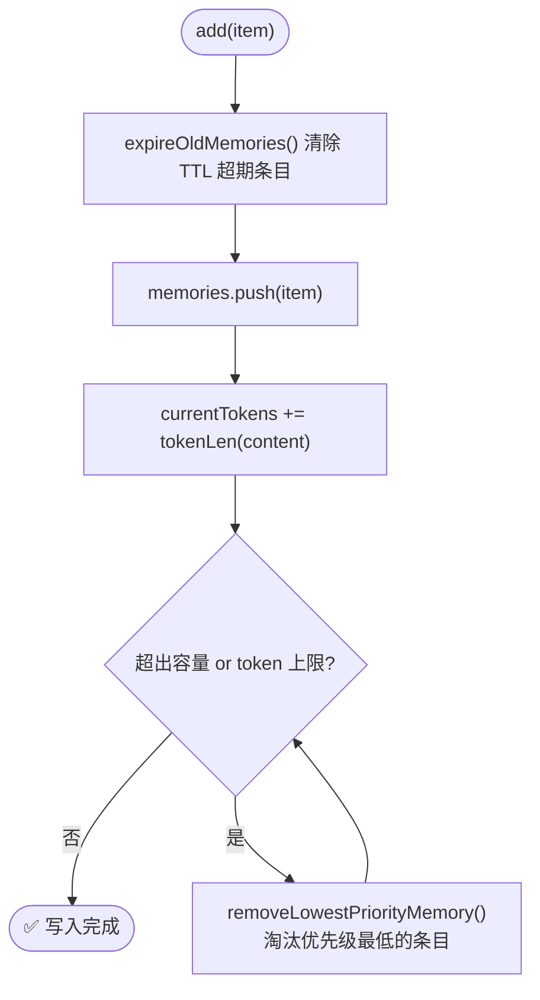

**优先级与时间衰减**：

```
priority(item)  = importance × timeDecay(timestamp)
timeDecay       = decayFactor ^ (hoursPassed / 6)
```

`decayFactor=0.95`，每 6 小时重要性打 95% 折扣，越旧越易被淘汰。

**检索得分**：`score = keywordScore × timeDecay × (0.8 + importance × 0.4)`

`keywordScore` 先做全词匹配，再做 Jaccard 词袋相似度。

**特有能力**：
- `getAll()` — 供 `consolidateMemories` 批量读取
- `getContextSummary(maxLength)` — 按优先级截取上下文文本，供 Agent 拼接 prompt
- `forget(strategy, threshold, maxAgeDays)` — 三种遗忘策略

---

### 4.2 EpisodicMemory — 情景记忆

**定位**：记录带时间戳和上下文的「事件」，类比日记。

**内部 Episode 结构**：`MemoryItem.metadata` 中的字段（`session_id`、`context`、`outcome`、`participants`、`tags`、`event_type`）被提取出来，构成更丰富的 `Episode` 对象。

**写入流程**：

```
add(memoryItem)
  ├─ 从 metadata 提取 Episode 字段
  ├─ episodes.push(ep)
  ├─ sessions.set(sessionId, [...ids])   // 维护 session 索引
  ├─ kvStore?.put(id, item)              // 持久化
  └─ vectorStore?.upsertVector(embed(content))  // 向量化存储（若存在）
```

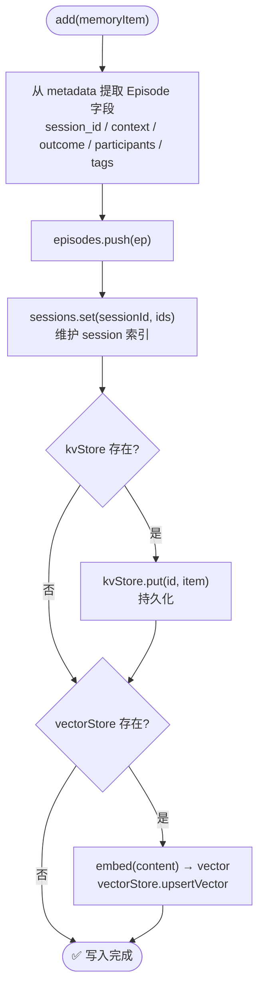

**检索策略（双路径）**：

- **有 vectorStore（主路径）**：查询向量化 → `queryVector`（候选 `limit×5`，最少 20）→ 过滤 → 综合得分
  - 过滤条件：`importanceThreshold` / `timeRange` / `metadata.context.forgotten`
  - 得分：`(vecScore×0.8 + recencyScore×0.2) × (0.8 + importance×0.4)`
  - `recencyScore = 1 / (1 + ageDays)`
  - 结果会把 `combined_score / vector_score / recency_score` 写回 `metadata`
- **无 vectorStore（降级）**：关键词匹配 + 时间衰减纯内存计算
  - 关键词命中仅判断 `content.includes(query)`，未做分词与模糊匹配
  - 同样会过滤 `importanceThreshold / timeRange / context.forgotten`

---

### 4.3 SemanticMemory — 语义记忆

**定位**：存储概念性知识、规则、原理，类比人的陈述性长期记忆。

**核心特性**：在向量检索基础上额外维护**知识图谱**（Entity + Relation），检索同时具备向量语义和图结构两路信号。

**写入流程**：

```
add(memoryItem)
  ├─ embed(content) → vec，存入 embeddings Map
  ├─ extractEntities(content)  // 分词，每个 token(len>=2) → Entity(CONCEPT)
  ├─ extractRelations(entities)  // 实体两两配对 → CO_OCCURS Relation
  ├─ addOrUpdateEntity/Relation  // 频次累加，strength+0.1
  ├─ vectorStore?.upsertVector
  ├─ graphStore?.upsertEntities / upsertRelations
  ├─ kvStore?.put
  └─ memories.push(item)
```

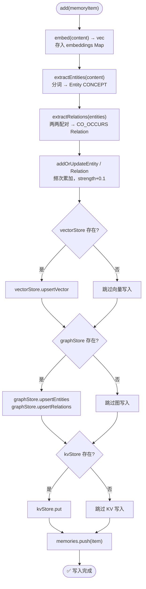

**检索评分**：`score = (vectorScore×0.7 + graphScore×0.3) × (0.8 + importance×0.4)`

**双路合并逻辑（有 Adapter 时）**：

- `vectorStore.queryVector` 返回向量候选
- `graphStore.queryGraph` 返回图实体候选
- `mergeAdapterResults` 以 `vectorScore × 0.7 + graphScore × 0.3` 合并
- 合并后把 `combined_score / vector_score / graph_score` 写回 `metadata`
- 若两路均为空，降级回本地 `embeddings` + `entities` 计算

```typescript
interface Entity { entityId: string; name: string; entityType: string; frequency: number; }
interface Relation { fromEntity: string; toEntity: string; relationType: string; strength: number; frequency: number; }
```

---

### 4.4 PerceptualMemory — 感知记忆

**定位**：存储多模态原始感知数据（文本/图像/音频/视频），类比感官记忆。

**Perception 结构**：每条 `MemoryItem` 对应一个 `Perception`，含 `perceptionId`、`modality`、`encoding`（384 维向量）、`dataHash`。

**模态索引**：`modalityIndex: Map<PerceptualModality, string[]>` 维护各模态 perceptionId 列表。

**写入流程**：

```
add(memoryItem)
  ├─ 从 metadata 读取 modality（默认 "text"）
  ├─ encodePerception(rawData, modality)  // 生成 encoding 向量
  ├─ perceptions.set / modalityIndex 追加
  ├─ kvStore?.put
  ├─ vectorStore?.upsertVector
  └─ blobStore?.putBlob(id, rawData)     // 原始二进制持久化
```

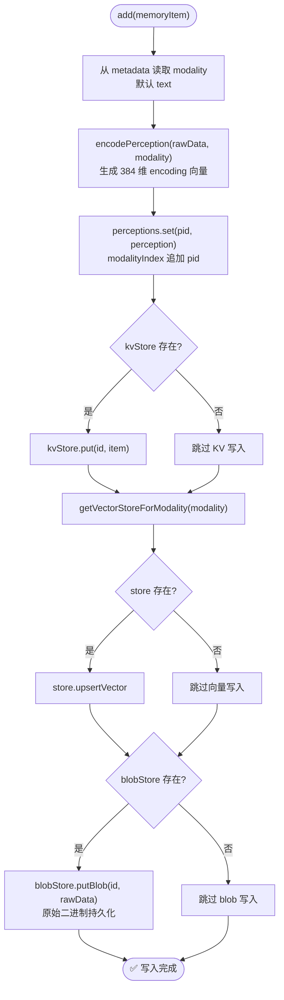

**跨模态检索**：`crossModalSearch(query, queryModality, targetModality)` 通过 `hashToVector` 将非文本数据映射到同维度向量空间实现跨模态检索。

---

## 5. MemoryManager — 管理层

`MemoryManager`（`src/memory/manager.ts`）是所有外部调用的统一入口。

### 5.1 初始化流程

```
new MemoryManager(options)
  ├─ 合并 config
  ├─ 初始化 AdapterRegistry
  ├─ AdapterFactory.createAdapters(adapterConfigs)
  ├─ adapterRegistry.register(adapters)
  └─ 按 enable* 开关实例化各记忆类型
       ├─ new WorkingMemory(config)
       ├─ new EpisodicMemory(config, { kvStore, vectorStore })
       ├─ new SemanticMemory(config, { vectorStore, graphStore, kvStore })
       └─ new PerceptualMemory(config, { vectorStore, blobStore })

manager.initialize()
  └─ adapterRegistry.initialize()  // 启动健康检查定时器
```

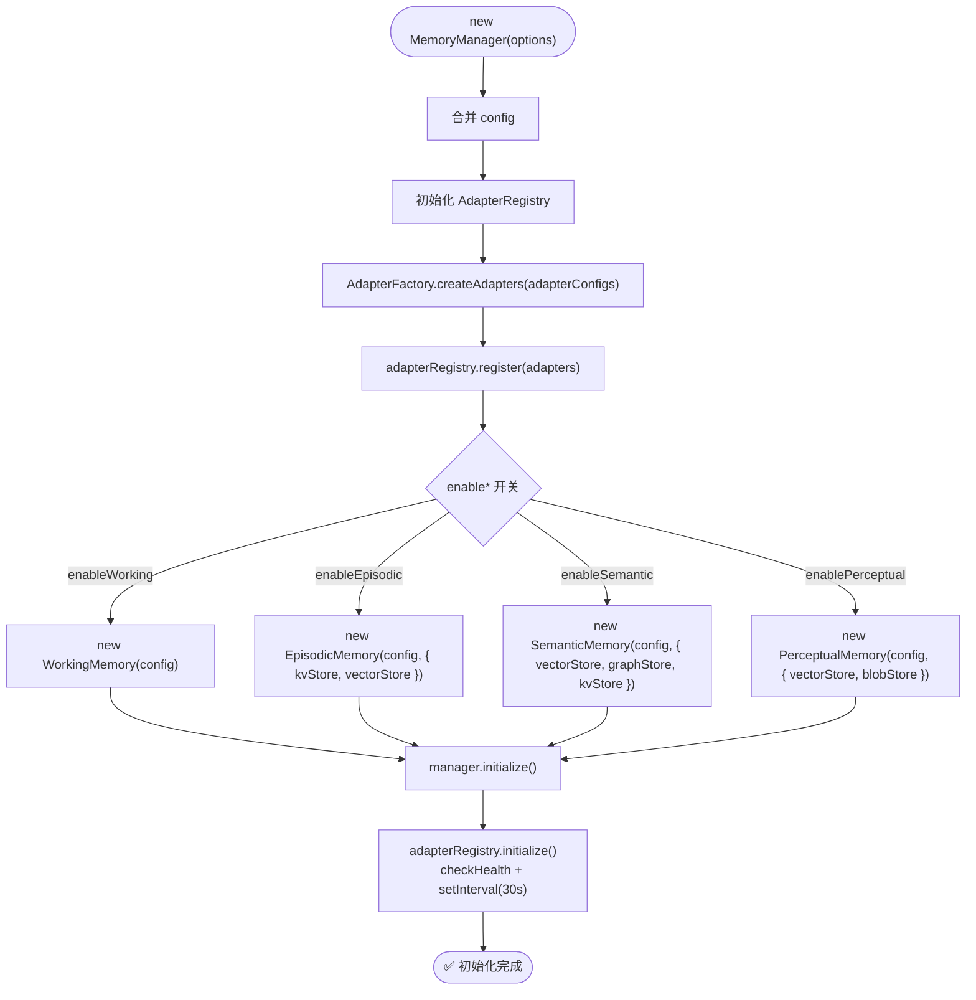

### 5.2 addMemory — 写入流程

```
addMemory({ content, memoryType, importance, metadata, autoClassify })
  ├─ finalType：显式指定 or classifyMemoryType()
  │     ├─ isEpisodicContent (含「昨天/今天/发生」等词) → "episodic"
  │     ├─ isSemanticContent (含「定义/概念/原理」等词) → "semantic"
  │     └─ 其余 → "working"
  ├─ finalImportance：显式传入 or calculateImportance()
  │     ├─ 基础分 0.5，length>100 +0.1，含「重要/关键」+0.2
  │     ├─ priority=="high" +0.3，priority=="low" -0.2
  ├─ 构建 MemoryItem（id=UUID, timestamp=now）
  └─ memory.add(item)
```

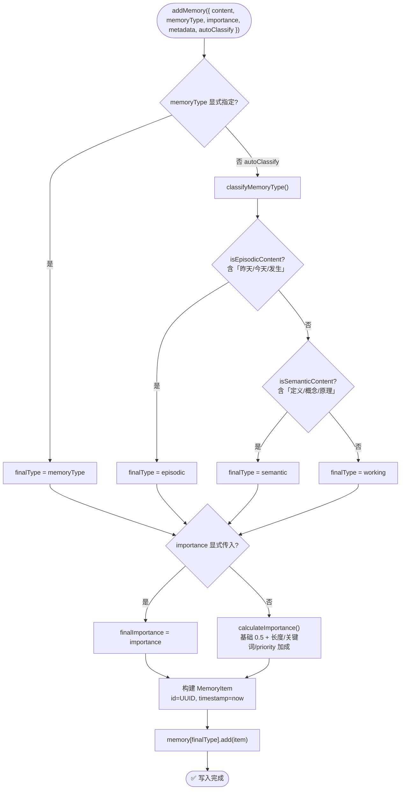

### 5.3 retrieveMemories — 检索流程

```
retrieveMemories({ query, memoryTypes, limit, minImportance, timeRange })
  ├─ selectedTypes = memoryTypes ?? Object.keys(enabledTypes)
  ├─ perTypeLimit = max(1, floor(limit / selectedTypes.length))
  ├─ 对每个类型调用 memory.retrieve(query, perTypeLimit, { userId })
  │     ├─ normalizeTimestamp(item)   // 兼容 Date/字符串/Firestore Timestamp
  │     ├─ 过滤 importance < minImportance
  │     └─ 过滤 timeRange
  ├─ 合并所有类型结果
  └─ 按 importance 降序，取前 limit 条返回
```

**细节补充**：
- `perTypeLimit` 最低为 1，确保每种类型至少返回 1 条候选
- 单个类型检索异常会被 `try/catch` 捕获并输出 `console.warn`，不会影响其他类型

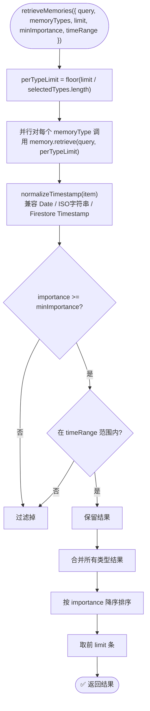

### 5.4 forgetMemories — 遗忘流程

```
forgetMemories({ strategy, threshold, maxAgeDays })
  └─ 遍历 memoryTypes，调用 memory.forget(strategy, threshold, maxAgeDays)
       ├─ "importance_based"：过滤 importance < threshold
       ├─ "time_based"：过滤超过 maxAgeDays 天的记忆
       └─ "capacity_based"：按优先级保留前 maxCapacity 条
```

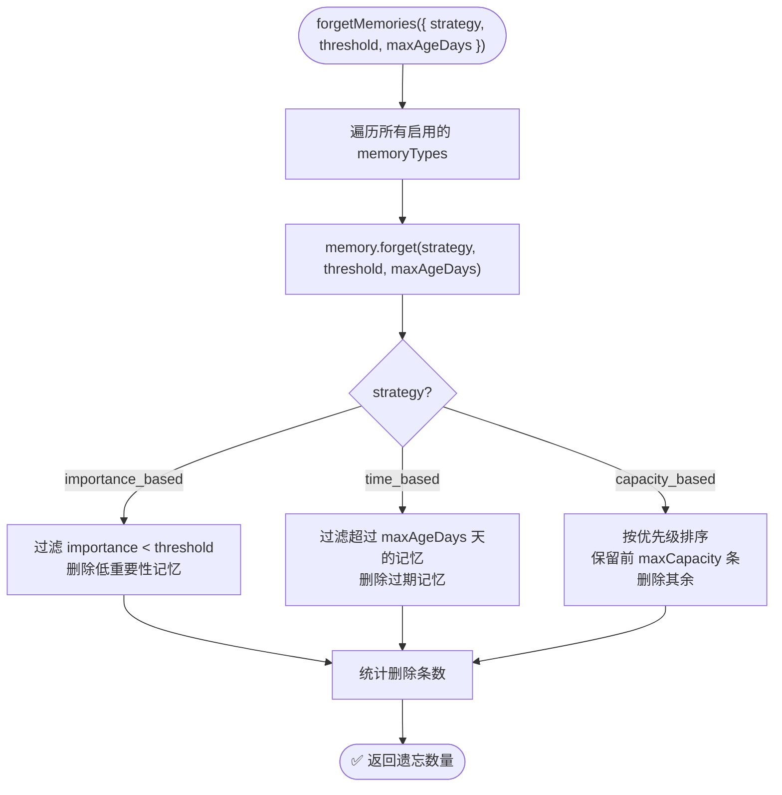

### 5.5 consolidateMemories — 记忆整合

记忆整合是**短期→长期**的升级机制，类比睡眠中的记忆巩固：

```
consolidateMemories({ fromType="working", toType="episodic", importanceThreshold=0.7 })
  ├─ sourceMemory.getAll() → 过滤 importance >= threshold
  └─ 对每条候选：
       ├─ sourceMemory.remove(id)
       ├─ movedMemory.importance = clamp01(importance × 1.1)  // 提升 10%
       └─ targetMemory.add(movedMemory)
```

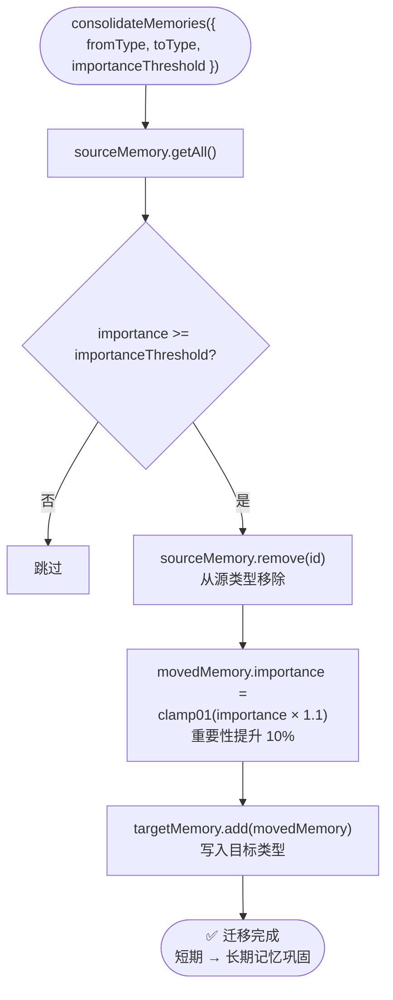

---

## 6. 存储适配层详解

### 6.1 四种适配器接口

```typescript
interface KVStoreAdapter<T> {
  put(id, item): Promise<void>;  get(id): Promise<T | null>;
  delete(id): Promise<void>;   list(params?): Promise<T[]>;
}
interface VectorStoreAdapter {
  upsertVector({ id, vector, payload }): Promise<void>;
  queryVector({ vector, limit, filter? }): Promise<Array<{id,score,payload}>>;
  deleteVector(id): Promise<void>;
}
interface GraphStoreAdapter {
  upsertEntities(entities): Promise<void>;
  upsertRelations(relations): Promise<void>;
  queryGraph({ queryText, limit }): Promise<Array<{entityId,score}>>;
  deleteByMemoryId(memoryId): Promise<void>;
}
interface BlobStoreAdapter {
  putBlob(id, data, meta?): Promise<void>;
  getBlob(id): Promise<Buffer | string | null>;
  deleteBlob(id): Promise<void>;
}
```

各适配器均可选实现 `health()` 和 `clear()`，供 `AdapterRegistry` 做健康检查和生命周期管理。

### 6.2 AdapterFactory — 工厂与扩展

```typescript
// 注册自定义后端（全局一次）
AdapterFactory.registerVectorStore("qdrant", (opts) => new MyQdrantAdapter(opts));

new MemoryManager({
  adapterConfigs: [
    { type: "kvStore",     backend: "memory" },
    { type: "vectorStore", backend: "qdrant", options: { url: "http://localhost:6333" } },
    { type: "graphStore",  backend: "neo4j",  options: { uri: "bolt://localhost:7687" } },
  ]
});
```

内部维护四张注册表（`Map<string, Factory>`），`createAdapters(configs)` 批量创建并返回 `MemoryStorageAdapters`。

### 6.3 AdapterRegistry — 生命周期与健康检查

```
initialize() → checkHealth() + setInterval(30s)
shutdown()   → clearInterval + clear() 各适配器
isHealthy()  → AND(kvStore, vectorStore, graphStore, blobStore)
```

### 6.4 内置 InMemory 实现

| 类 | 数据结构 | 检索方式 |
|----|---------|----------|
| `InMemoryKVStore<T>` | `Map<string, T>` | id 直接查 |
| `InMemoryVectorStore` | `Map<string, {vector,payload}>` | 余弦相似度全量扫描 |
| `InMemoryGraphStore` | `Map<string, Entity> + Relation[]` | 关键词 token 精确匹配 |
| `InMemoryBlobStore` | `Map<string, {data,meta}>` | id 直接查 |

### 6.5 外部存储适配器

- **QdrantVectorStore**（`storage/qdrant.ts`）：支持 Cosine/Euclid/Dot/Manhattan 距离，自动创建 Collection，filter 转换为 Qdrant `must` 语法。
- **Neo4jGraphStore**（`storage/neo4j.ts`）：实体/关系 MERGE 操作，Cypher 查询图结构。

---

## 7. RAG Pipeline 详解

RAG Pipeline（`src/memory/rag/pipeline.ts`）是独立的文档检索增强模块，专为外部文档知识库场景设计。

### 7.1 文档写入链路

```
loadAndChunkTexts({ paths, chunkSize=800, chunkOverlap=100, markitdownAdapter })
  ├─ convertToMarkdown        // markitdown 可用则转换，否则 fallback 读取
  ├─ splitParagraphsWithHeadings  // 按 # 标题分段，记录 heading_path
  ├─ chunkParagraphs(chunkSize, chunkOverlap)
  └─ contentHash 去重 → RagChunk[]

indexChunks({ store, chunks, embedder, batchSize=64 })
  ├─ preprocessMarkdownForEmbedding  // 去 Markdown 符号
  ├─ embedder.encode(texts) → normalize2DVectors
  └─ store.upsertVector(id, vector, payload) 逐条写入
```

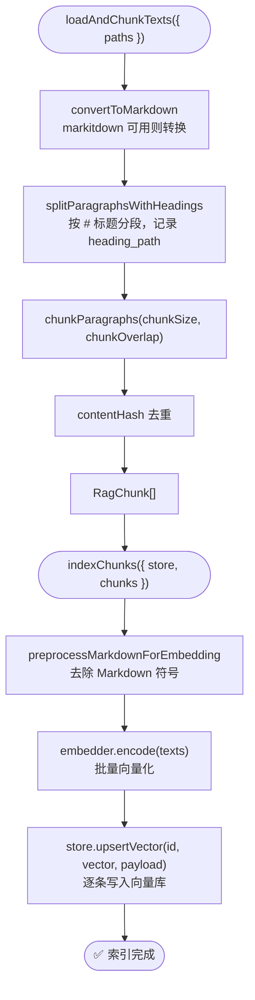

### 7.2 查询链路

```
searchVectors(query)               // 标准查询
  ├─ embedQuery(query)
  └─ store.queryVector({ vector, limit, filter })

searchVectorsExpanded(query)       // 高级查询
  ├─ MQE：LLM 生成 N 个语义等价查询（可选）
  ├─ HyDE：LLM 先生成假设答案段落再查询（可选）
  ├─ 多路向量检索，候选池合并去重（取最高分）
  └─ 按分数排序返回 topK
```

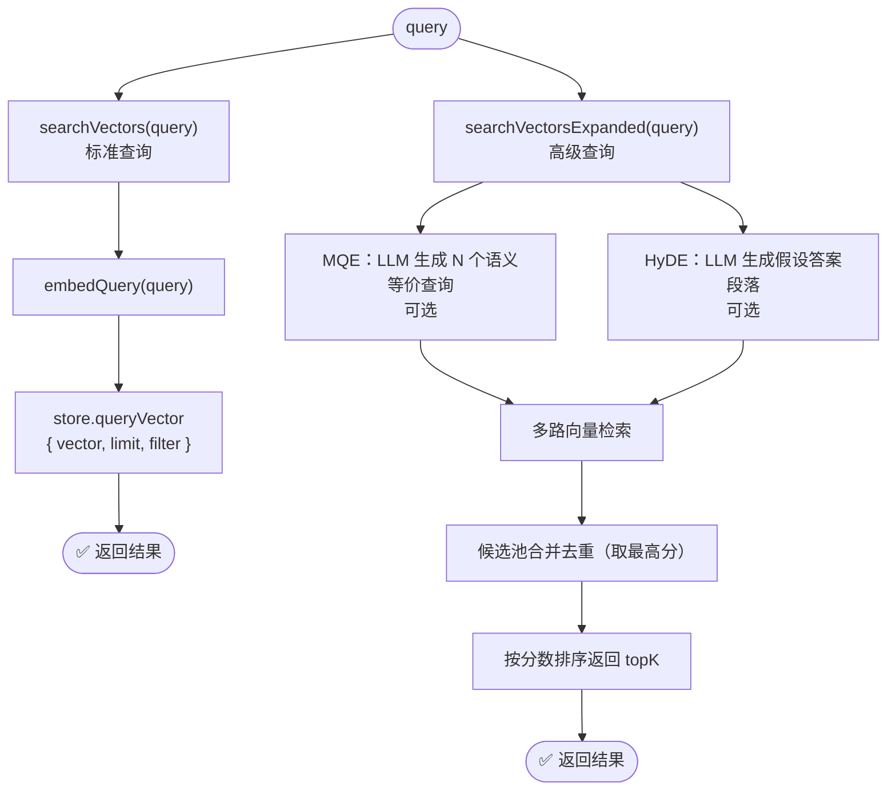

### 7.3 向量化实现对比

| 实现 | 适用场景 | 说明 |
|------|---------|------|
| `HashTextEmbedder` | 本地/无 API 场景 | 分词→MD5→384 维归一化向量 |
| `OpenAITextEmbedder` | 生产高质量检索 | 调用 OpenAI Embeddings API，需配置 `EMBEDDING_*` 环境变量 |
| `createDefaultTextEmbedder` | 默认选择 | 根据配置创建 embedder（默认 Hash，配置后可切 OpenAI） |

### 7.4 后处理工具函数

| 函数 | 作用 |
|------|------|
| `rank` | 向量分×0.7 + 图信号×0.3 融合排序 |
| `computeGraphSignalsFromPool` | 同文档密度 + 位置邻近度计算图信号 |
| `rerankWithCrossEncoder` | 接入 reranker 精排 |
| `compressRankedItems` | 相邻 chunk 合并，减少冗余 |
| `expandNeighborsFromPool` | 扩展前后邻居，增强上下文 |
| `mergeSnippetsGrouped` | 截取合并文本，支持引用标注 |
| `tldrSummarize` | LLM 对检索结果做要点摘要 |

### 7.5 Document / DocumentChunk

`src/memory/rag/document.ts`：`Document`（完整文档）、`DocumentChunk`（分块单元）、`DocumentProcessor`（分割/合并/过滤/元数据注入）。

---

## 8. MemoryTool — 工具层

`MemoryTool`（`src/tools/builtin/memory.ts`）继承自 `Tool`，是 Memory 系统的 Agent 调用入口。

### 8.1 职责划分

| 职责 | 由谁承担 |
|------|----------|
| 参数校验（Zod schema） | MemoryTool |
| action 路由 | MemoryTool |
| 会话追踪（sessionId / conversationCount） | MemoryTool |
| 结果格式化 | MemoryTool |
| 实际存储/检索/遗忘/整合 | MemoryManager |

### 8.2 run() 调用链

```
run(parameters)
  ├─ validateAndNormalizeParameters  // 基础校验
  ├─ validateActionParameters        // 按 action 做结构化 Zod 校验
  └─ switch(action) → add / search / summary / stats / update / remove / forget / consolidate / clear_all
```

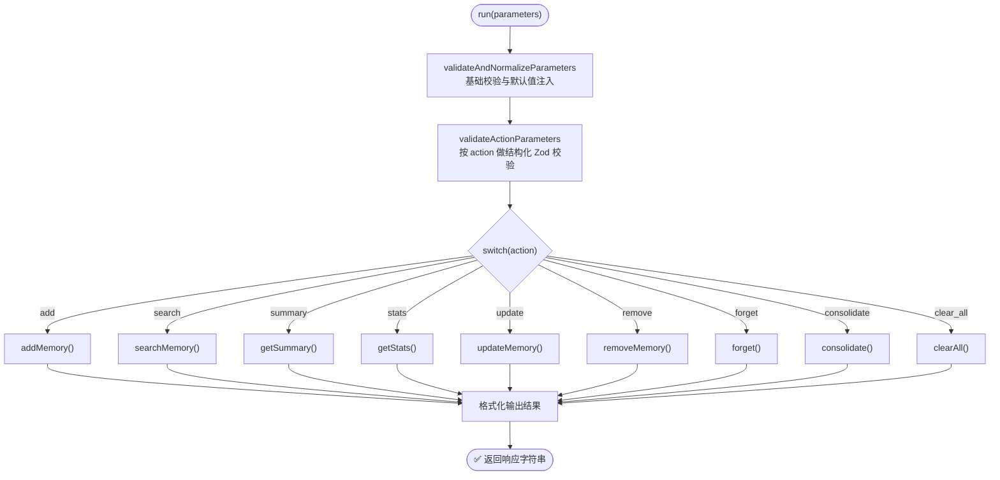

### 8.3 会话管理

- `currentSessionId`：首次 `addMemory` 时自动生成（时间戳格式），写入 `metadata.session_id`。
- `conversationCount`：对话轮次计数，供统计与自动记录使用。
- `MemoryTool` 会把 `session_id` 透传给 EpisodicMemory，最终落到 `episodes` 索引与向量库 payload 的 `metadata.session_id` 字段。

### 8.4 自动记录对话

```
autoRecordConversation(userInput, agentResponse)
  ├─ conversationCount++
  ├─ addMemory(`用户: ${userInput}`, "working", workingImportance)
  ├─ addMemory(`助手: ${agentResponse}`, "working", workingImportance)
  └─ 满足以下任一条件时额外写入 episodic：
       ├─ 含关键词（默认「重要」「记住」）
       └─ 总长度 >= minLengthForEpisodic（默认 100）
```

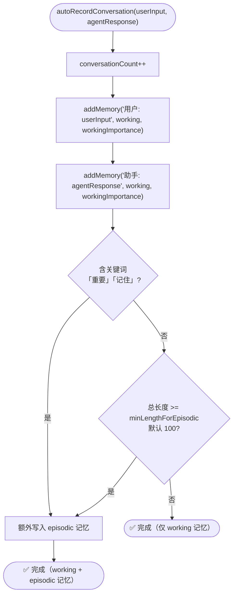

### 8.5 可展开子工具（@toolAction）

当 `expandable=true` 时自动展开：`memory_add` / `memory_search` / `memory_summary` / `memory_stats` / `memory_update` / `memory_remove` / `memory_forget` / `memory_consolidate` / `memory_clear`

### 8.6 快捷 API

| 方法 | 说明 |
|------|------|
| `addKnowledge(content, importance=0.9)` | 快速写语义记忆 |
| `getContextForQuery(query, limit=3)` | 检索结果拼成 context 文本 |
| `clearSession()` | 清除会话状态并清空所有记忆 |
| `forgetOldMemories(maxAgeDays=30)` | 按时间策略批量遗忘 |

---

## 9. 完整调用链路示例

### 9.1 写入链路

```
用户: "帮我记住：下周五要提交项目报告，这很重要"

MemoryTool.run({ action:"add", content:"下周五要提交项目报告", importance:0.9 })
  ├─ Zod 校验通过
  ├─ addMemory → WorkingMemory.add(item)
  │     ├─ currentSessionId = "20260312143000"（首次生成）
  │     ├─ memories.push(item), currentTokens += 7
  │     └─ enforceCapacityLimits()（未超限）
  └─ 返回 "✅ 记忆已添加 (ID: uuid-xxx...)"

// autoRecordConversation 含「重要」关键词，触发 episodic 写入：
EpisodicMemory.add → kvStore.put + vectorStore.upsertVector
```

### 9.2 检索链路

```
MemoryTool.run({ action:"search", query:"项目报告", limit:3 })
  └─ retrieveMemories({ query, limit:3 })
        ├─ WorkingMemory  → score ≈ 0.58（关键词 × 时间衰减）
        ├─ EpisodicMemory → combined ≈ 0.96（vecScore×0.8 + recency×0.2）
        ├─ SemanticMemory → []（无记忆）
        └─ 按 importance 降序返回
```

### 9.3 整合链路

```
MemoryTool.run({ action:"consolidate", importance_threshold:0.7 })
  └─ consolidateMemories({ fromType:"working", toType:"episodic", threshold:0.7 })
        ├─ getAll() → 过滤 importance >= 0.7
        ├─ WorkingMemory.remove("uuid-xxx")
        ├─ movedItem.importance = clamp01(0.9 × 1.1) = 0.99
        └─ EpisodicMemory.add(movedItem) → 持久化到向量库
```

---

## 10. 可靠性与降级策略

| 场景 | 降级行为 |
|------|----------|
| vectorStore 不可用 | EpisodicMemory/SemanticMemory 退回纯内存关键词检索 |
| graphStore 不可用 | SemanticMemory 退回纯向量检索（graphScore=0） |
| kvStore 不可用 | 仅内存数组，重启后丢失持久化数据 |
| blobStore 不可用 | PerceptualMemory 仅保留向量索引，原始 blob 不持久化 |

- **写入一致性**：先写内存数组，再异步写外部存储，不做跨适配器事务。
- **timestamp 归一化**：`normalizeTimestamp` 兼容 `Date`、ISO 字符串、Firestore Timestamp。
- **importance clamp**：所有写入路径通过 `clamp01` 保证值域 [0,1]。
- WorkingMemory 超出容量/token 上限时自动淘汰最低优先级条目；其他类型依赖显式 `forgetMemories`。

---

## 11. 局限与演进建议

### 11.1 当前限制

1. `classifyMemoryType` 仅做关键词匹配，自动分类精度低。
2. `extractEntities` 仅按空格分词，无 NER，图谱质量受限。
3. 跨类型检索无融合重排，各类型独立检索后按 importance 合并。
4. 无记忆去重，相似内容可多次写入产生噪声。
5. EpisodicMemory 内存 `episodes` 数组重启后丢失（仅 KV/VectorStore 持久化，内存索引不落盘）。
6. consolidate 仅支持单向迁移（working→episodic）。
7. `PerceptualMemory` 默认未启用，若不显式 `enablePerceptual` 将完全不初始化。

### 11.2 演进建议

- **P1**：embedding 相似度去重、LLM 辅助分类、`getContextSummary` 结构化格式
- **P2**：NER 提升图谱质量、跨类型 cross-encoder 重排、consolidate 任意类型迁移
- **P3**：telemetry（命中率/P95 延迟/遗忘比例）、EpisodicMemory 本地持久化、tsd 类型测试套件

---

## 12. 总结

```
工具层   MemoryTool        — Zod 校验、action 路由、会话跟踪、格式化输出
管理层   MemoryManager     — 类型分发、自动分类、跨类型检索合并、遗忘/整合编排
类型层   Working/Episodic/Semantic/Perceptual — 存储结构、检索评分、向量化
适配层   AdapterFactory/Registry             — 插件化后端、健康检查、生命周期
RAG 层   RagPipeline       — 文档切块、向量索引、MQE/HyDE 检索、后处理排序
```

**设计亮点**：
- `MemoryItem` 贯穿所有层，统一数据载体。
- `AdapterFactory` 注册机制无需改核心代码即可接入任意存储后端。
- SemanticMemory 向量+图双路融合、EpisodicMemory 向量+时效加权，多信号融合检索。
- WorkingMemory 容量/token/TTL 三重保护防止上下文溢出。
- `consolidateMemories` 模拟睡眠巩固，使重要信息不随 TTL 丢失。
- 所有外部存储均有内存 fallback，保证无外部依赖时系统仍可正常运行。
 