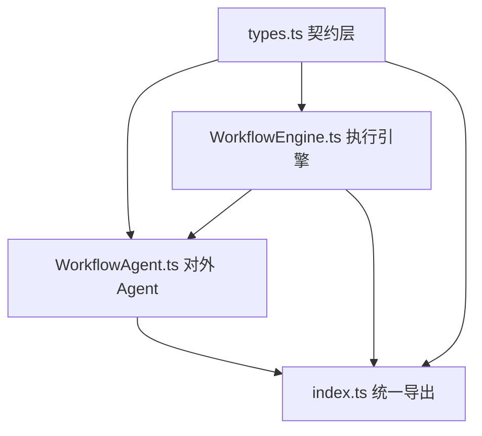
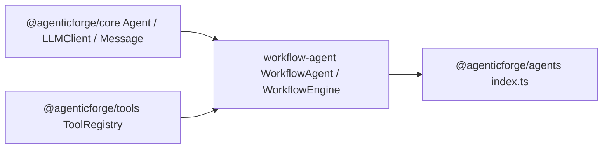
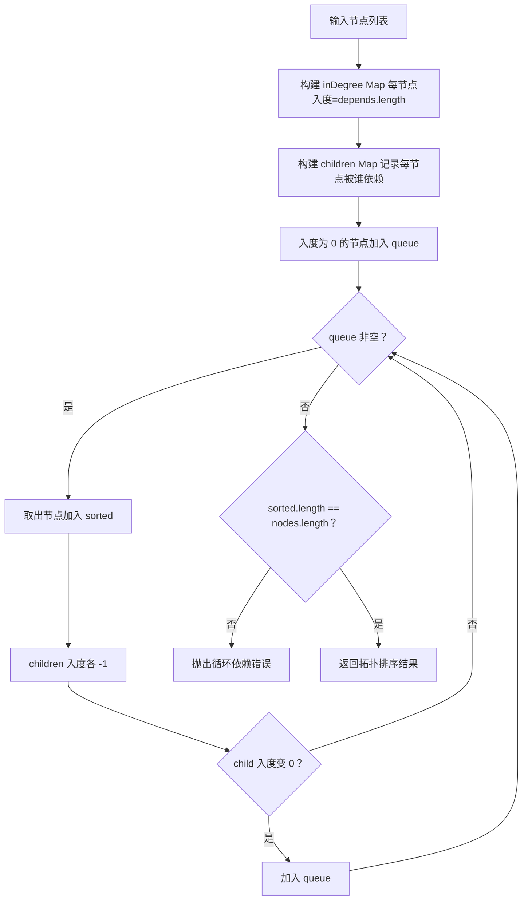
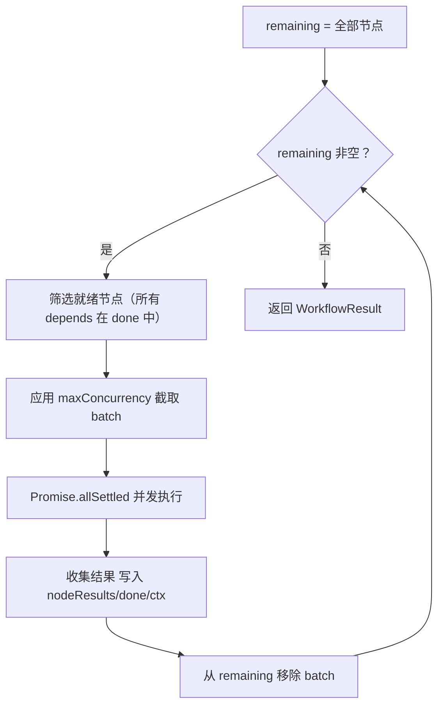
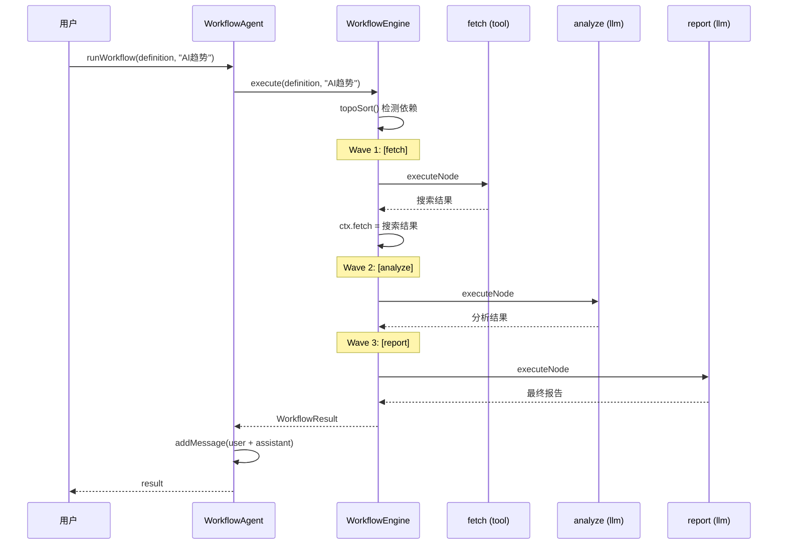
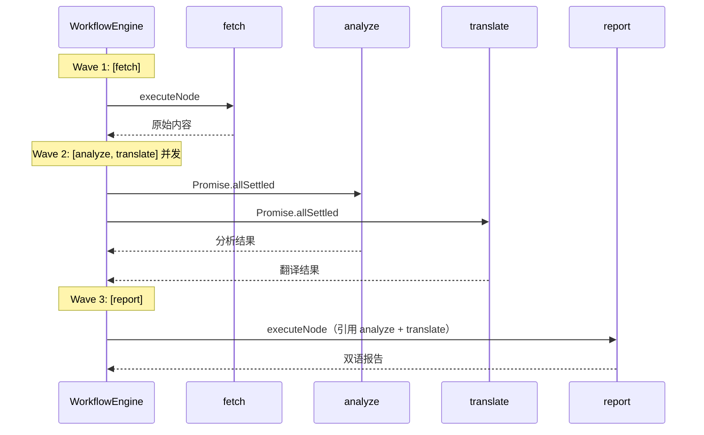
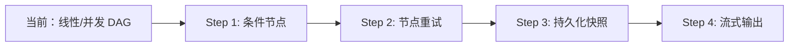
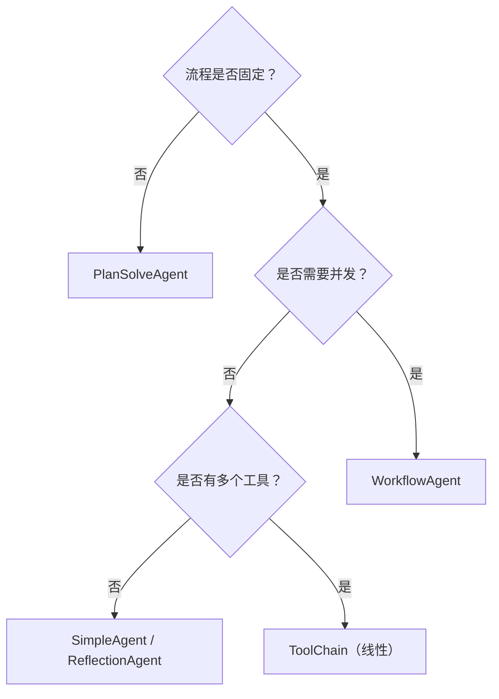

# WorkflowAgent 详细解析文档

> 版本：`@agenticforge/agents@1.2.1`  
> 源文件：`packages/agents/src/workflow-agent/`

---

## 1. 系统定位与设计哲学

### 问题起点

| 已有组件 | 局限 |
|---|---|
| `FunctionCallAgent` | 工具调用顺序由 LLM 决定，不可预测，无法保证确定性流程 |
| `PlanSolveAgent` | 自动规划步骤，但步骤串行、不可并发，且每次运行计划可能不同 |
| `ToolChain` | 纯线性管道，无条件分支，无并发，无状态共享 |

**核心矛盾**：企业自动化场景需要**确定性流程 + 并发提速 + 灵活节点类型**，现有组件无法同时满足。

### 设计哲学

> **用 DAG 描述「做什么」，用引擎决定「怎么做」。**

开发者以声明式方式定义节点和依赖，`WorkflowEngine` 自动推导执行顺序和并发策略，节点间通过共享 `context` 传递数据。

### 传统方式 vs WorkflowAgent 对比

| 维度 | ToolChain | PlanSolveAgent | WorkflowAgent |
|---|---|---|---|
| 流程定义 | 代码硬编码线性顺序 | LLM 每次动态生成 | 开发者声明式 DAG |
| 并发能力 | 无 | 无 | 同波次节点自动并发 |
| 节点类型 | 仅 Tool | 仅 LLM 步骤 | tool / llm / fn / passthrough |
| 确定性 | 高 | 低 | 高 |
| 上下文共享 | 串行透传字符串 | 步骤结果拼接字符串 | 结构化 WorkflowContext Map |
| 循环依赖检测 | 无 | 无 | Kahn 算法，启动时检测 |

---

## 2. 整体架构与模块依赖

### 2.1 包内模块结构



### 2.2 跨包依赖



### 2.3 依赖方向原则

- `types.ts` 零依赖，是系统的类型契约层
- `WorkflowEngine` 只依赖 `types.ts` 和外部包，不依赖 `WorkflowAgent`
- `WorkflowAgent` 依赖 `WorkflowEngine`，实现 `Agent` 基类接口
- 依赖方向严格单向，无循环

---

## 3. 契约层：核心类型系统

### 3.1 WorkflowContext

```typescript
export type WorkflowContext = Record<string, string>;
```

节点间数据传递的载体。引擎初始化时注入 `{ input: "用户输入" }`，每个节点执行完成后以 `nodeId` 为 key 写入输出，后续节点通过 `{nodeId}` 占位符引用。

**设计意图**：选择 `Record<string, string>` 而非复杂对象，强制所有节点输出序列化为字符串，与 LLM 的输入输出格式天然对齐。

### 3.2 WorkflowNode（联合类型）

```typescript
export type WorkflowNode =
  | { id: string; type: "tool";        toolName: string; inputTemplate: string; depends?: string[] }
  | { id: string; type: "llm";         promptTemplate: string; systemPrompt?: string; depends?: string[] }
  | { id: string; type: "fn";          executor: NodeExecutorFn; depends?: string[] }
  | { id: string; type: "passthrough"; sourceKey?: string; depends?: string[] };
```

| 字段 | 说明 |
|---|---|
| `id` | 节点唯一标识，同时作为输出写入 context 的 key |
| `type` | 节点执行模式，决定 `executeNode` 的分支 |
| `depends` | 依赖节点 id 列表，缺省为空数组（无依赖，最早执行） |
| `inputTemplate` / `promptTemplate` | 支持 `{变量}` 插值，变量名对应 context 中的 key |
| `executor` | `fn` 节点签名：`(ctx, llm, registry?) => Promise<string>` |
| `sourceKey` | `passthrough` 透传的 context key，缺省为 `"input"` |

**联合类型的意图**：利用 TypeScript discriminated union，`type` 字段作为判别符，`switch` 语句获得完整类型收窄，无需类型断言。

### 3.3 WorkflowDefinition

```typescript
export interface WorkflowDefinition {
  name: string;
  nodes: WorkflowNode[]; // 顺序无关，引擎自动拓扑排序
}
```

### 3.4 执行结果类型

```typescript
export interface NodeResult {
  nodeId: string;
  status: "pending" | "running" | "done" | "failed";
  output: string;
  error?: string;
  durationMs: number; // 单节点执行耗时（毫秒）
}

export interface WorkflowResult {
  output: string;            // 拓扑序最后一个成功节点的输出
  nodeResults: NodeResult[]; // 所有节点结果，顺序同执行顺序
  context: WorkflowContext;  // 完整 context 快照
}
```

---

## 4. WorkflowEngine：执行引擎

### 4.1 设计意图

`WorkflowEngine` 是纯粹的执行层，不继承任何 Agent 基类，不维护对话历史，职责单一：接收定义、排序、并发调度、收集结果。

### 4.2 配置项

| 选项 | 类型 | 默认值 | 说明 |
|---|---|---|---|
| `llm` | `LLMClient` | 必填 | 供 `llm`/`fn` 节点使用 |
| `registry` | `ToolRegistry` | 可选 | `tool` 节点必须提供 |
| `verbose` | `boolean` | `false` | 打印每个波次的执行日志 |
| `maxConcurrency` | `number` | 不限制 | 单波次最大并发节点数 |

### 4.3 核心机制一：Kahn 算法拓扑排序



**两层错误检测**：
1. **引用不存在的节点**：构建 `children` Map 时，若 `dep` 不在节点 Map 中，立即抛出详细错误
2. **循环依赖**：排序完成后 `sorted.length !== nodes.length` 即有环，抛出错误并列出涉及节点

**波次分层示意**：

```
A(入度0) --> B(入度1) --> D(入度2)
C(入度0) -----------> D

wave1: [A, C] 并发
wave2: [B]（A完成后入度变0）
wave3: [D]（B和C都完成后入度变0）
```

### 4.4 核心机制二：波次（Wave）并发调度



**关键设计决策**：

| 决策 | 选择 | 原因 |
|---|---|---|
| 并发原语 | `Promise.allSettled` | 单节点失败不中断波次，其余节点继续执行 |
| 失败处理 | 失败节点不写入 ctx | 后续引用得到保留占位符，不崩溃 |
| maxConcurrency | 仅在单次 wave 内截取 | 同波次内按上限并发，不跨波次限流 |
| 最终输出 | 拓扑序最后一个成功节点 | 通常即用户关心的「终节点」输出 |

### 4.5 四种节点类型执行逻辑

| 类型 | 执行逻辑 | 必要前提 |
|---|---|---|
| `tool` | `interpolate(inputTemplate)` → `registry.execute(toolName, {input})` | `registry` 不能为空 |
| `llm` | `interpolate(promptTemplate)` → 构建 messages → `llm.think(messages)` | 无 |
| `fn` | `node.executor(ctx, llm, registry)` | 无 |
| `passthrough` | `ctx[sourceKey ?? "input"]` | 对应 key 需存在于 ctx |

**插值函数 `interpolate`**：

```typescript
function interpolate(template: string, ctx: WorkflowContext): string {
  return template.replace(/{(\w+)}/g, (_m, key) => ctx[key] ?? `{${key}}`);
}
```

若 key 不存在，**保留原始占位符** `{key}` 而非替换为空字符串，便于调试时定位配置错误。

---

## 5. WorkflowAgent：对外接口层

### 5.1 两种调用模式

| 模式 | 方法 | 适用场景 |
|---|---|---|
| 模式 A | `runWorkflow(definition, input)` | 每次传入不同工作流定义，灵活 |
| 模式 B | `setWorkflow(definition)` + `run(input)` | 固定工作流，多次复用，接口统一 |

```typescript
// 模式 A — 返回完整 WorkflowResult
const result = await agent.runWorkflow(definition, "用户输入");
console.log(result.output);       // 最终输出
console.log(result.nodeResults);  // 每个节点的耗时与状态
console.log(result.context);      // 完整 context 快照

// 模式 B — 预设工作流，复用标准 Agent 接口
agent.setWorkflow(definition);
const output = await agent.run("用户输入"); // history 自动记录
agent.clearHistory();
```

`run()` 在未设置 `currentWorkflow` 时抛出明确错误，防止误用。

### 5.2 对话历史管理

`runWorkflow` 执行完成后调用 `addMessage` 将 user input 和 assistant output 写入历史，与其他 Agent 行为保持一致，支持 `clearHistory()` 重置。

---

## 6. 完整请求生命周期追踪

### 6.1 线性流水线场景



### 6.2 并发 fan-out / fan-in 场景



---

## 7. 关键设计决策深度分析

### 7.1 为什么用 DAG 而非 LLM 动态规划？

- **背景**：PlanSolveAgent 每次运行由 LLM 生成步骤，步骤不可预测
- **优点**：声明式 DAG 可测试、可审计、可版本控制
- **缺点**：需要开发者提前设计流程，不适合完全动态场景
- **结论**：工作流自动化优先确定性；完全动态场景使用 PlanSolveAgent

### 7.2 为什么选 Kahn 算法而非 DFS 拓扑排序？

- **背景**：两种经典拓扑排序算法均可检测环
- **优点**：Kahn 算法天然输出「波次分层」—— 每一轮入度为 0 的节点即下一个并发批次，与 wave 模型完美契合
- **缺点**：需维护 `inDegree` 和 `children` 两个 Map
- **结论**：DFS 拓扑排序不直接体现并发层次，需额外后处理；Kahn 更自然

### 7.3 为什么选 Promise.allSettled 而非 Promise.all？

- **背景**：波次内节点并发执行，某个节点可能失败
- **优点**：`allSettled` 让失败节点不影响同波次其他节点，提高整体鲁棒性
- **缺点**：失败节点的输出缺失，下游节点可能得到不完整数据
- **结论**：Agent 系统容错优先于快速失败；失败信息通过 `nodeResults` 暴露给调用方

### 7.4 为什么 WorkflowContext 是 Record<string, string>？

- **背景**：节点间可以传递任意数据
- **优点**：字符串类型天然适配 LLM prompt 插值；简单、无歧义
- **缺点**：结构化数据需要序列化/反序列化
- **结论**：WorkflowAgent 定位是 LLM 驱动的文本流水线；结构化数据场景使用 `fn` 节点自行处理

---

## 8. 可靠性与降级机制

| 失败点 | 降级策略 | 实现位置 |
|---|---|---|
| 节点引用未定义的依赖 | 构建阶段立即抛出错误 | `topoSort()` children 构建 |
| 循环依赖 | 排序后断言，抛出错误并列出节点 | `topoSort()` 末尾 |
| `tool` 节点无 `registry` | 执行前检查，抛出明确错误 | `executeNode` case "tool" |
| 单节点执行异常 | 记录错误，不写入 ctx，波次继续 | `Promise.allSettled` + catch |
| 所有节点失败 | `output` 为空字符串，`nodeResults` 记录全部信息 | `execute()` 最终输出逻辑 |
| `run()` 未设置 workflow | 抛出明确提示错误 | `WorkflowAgent.run()` |

**整体降级哲学**：配置错误快速失败（阻止执行），运行时错误局部隔离（不扩散），最终结果完整暴露（nodeResults 可审计）。

---

## 9. 当前局限与演进路径

### 局限

| 限制 | 描述 | 影响范围 |
|---|---|---|
| 节点输出仅支持字符串 | `WorkflowContext` 强制 string | 结构化数据需手动序列化 |
| 无条件分支 | 不支持 if/else 节点 | 动态流程场景 |
| 无节点重试机制 | 失败即记录，不自动重试 | 瞬时错误场景 |
| 无持久化 | 运行结果不持久化，重启丢失 | 长耗时流水线 |
| maxConcurrency 仅波次内生效 | 不支持全局并发上限 | 极高并发场景 |

### 演进方向

| 方向 | 实现思路 | 优先级 |
|---|---|---|
| 条件节点 `type: "condition"` | executor 返回 next 节点 id，引擎动态调整 remaining | 高 |
| 节点重试 | `WorkflowNode` 增加 `retry?: number`，executeNode 捕获异常后循环 | 高 |
| 流式输出 | `execute` 返回 `AsyncGenerator`，逐节点 yield | 中 |
| 持久化快照 | `WorkflowContext` 序列化到 KV store，支持断点续跑 | 中 |
| 可视化调试 | `nodeResults` 已包含耗时和状态，适合接入 Gantt 图展示 | 低 |



---

## 附录：快速参考卡

### 选型决策



### 节点类型速查

| 我想做什么 | 用哪种节点 | 关键字段 |
|---|---|---|
| 调用已注册工具 | `tool` | `toolName`, `inputTemplate` |
| 调用 LLM 生成文本 | `llm` | `promptTemplate`, `systemPrompt?` |
| 执行自定义逻辑 | `fn` | `executor: (ctx, llm, registry) => Promise<string>` |
| 透传上游输出 | `passthrough` | `sourceKey?`（默认 `"input"`） |

### 常见错误与修复

| 错误信息 | 原因 | 修复 |
|---|---|---|
| `依赖了未定义的节点 Y` | `depends` 中的 id 拼写错误 | 检查节点 id 是否一致 |
| `存在循环依赖` | 节点 A 依赖 B，B 又依赖 A | 检查 `depends` 配置，去除环路 |
| `类型为 tool 但未提供 ToolRegistry` | `registry` 未传入 | 构造 `WorkflowAgent` 时传入 `registry` |
| `请先调用 setWorkflow()` | 调用 `run()` 前未预设工作流 | 先调用 `agent.setWorkflow(definition)` |
