# WorkflowAgent 四种执行模式详细解析

> 版本：`@agenticforge/agents@1.3.0`  
> 源文件：`packages/agents/src/workflow-agent/`

---

## 1. 系统定位与设计哲学

### 1.1 本次升级解决的问题

| 原有限制 | 根因 | 影响 |
|---|---|---|
| 只支持 Sequential + Parallel | `WorkflowNode` 联合类型仅含 4 种叶节点 | 无法表达条件分支和循环逻辑 |
| 分支逻辑只能写在 `fn` 节点内 | 没有专用节点类型 | 代码侵入，无法声明式描述 |
| 循环逻辑只能在外层手写 | 引擎不感知循环 | 无执行追踪，无 maxIterations 安全保护 |

### 1.2 设计哲学

> **所有控制流都是节点。节点构成 DAG，DAG 可以嵌套。**

- `branch` 节点：把「选择」表达为声明式配置，而非命令式 if/else
- `loop` 节点：把「重复」表达为声明式配置，引擎负责 do-while 语义和安全上限
- 子 DAG 与顶层 DAG 共享同一个 `WorkflowContext`，数据无缝流动

---

## 2. 整体架构与模块依赖

### 2.1 包内模块结构

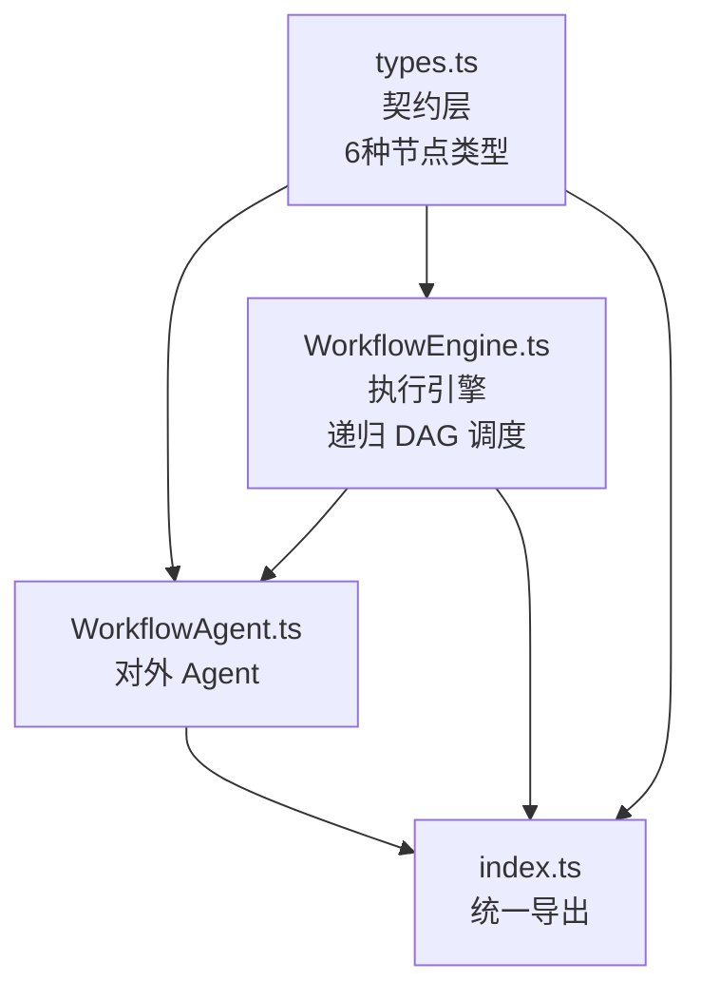

### 2.2 跨包依赖

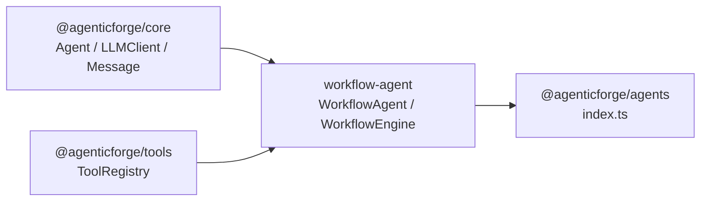

### 2.3 节点类型继承关系

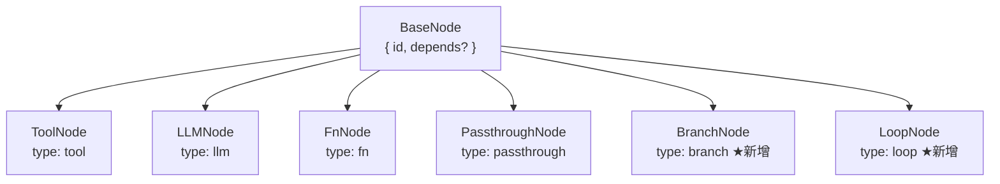

---

## 3. 契约层：核心类型系统

### 3.1 BranchNode

```typescript
export interface BranchNode extends BaseNode {
  type: "branch";
  /**
   * 条件函数，返回要执行的分支名称。
   * 若返回值不在 branches 中，引擎将抛出错误。
   */
  condition: (ctx: WorkflowContext) => string | Promise<string>;
  /**
   * 分支名称 → 子节点列表（每条分支都是一个小型 DAG）。
   */
  branches: Record<string, WorkflowNode[]>;
}
```

| 字段 | 说明 |
|---|---|
| `condition` | 接收当前 context，返回分支名。支持 async。 |
| `branches` | key 是分支名，value 是子节点数组（完整 DAG，支持嵌套 branch/loop） |
| `depends` | 继承自 BaseNode，控制何时开始执行 |

**设计意图**：`condition` 是运行时函数而非模板字符串，允许用任意 TypeScript 逻辑决定分支，包括调用外部服务或解析 JSON 输出。

### 3.2 LoopNode

```typescript
export interface LoopNode extends BaseNode {
  type: "loop";
  /** 每次迭代执行的子节点列表（DAG） */
  body: WorkflowNode[];
  /**
   * 迭代结束后调用的终止条件（do-while 语义）。
   * 返回 true 继续，false 停止。省略时仅受 maxIterations 控制。
   */
  condition?: (ctx: WorkflowContext, iteration: number) => boolean | Promise<boolean>;
  /** 最大迭代次数，默认 10 */
  maxIterations?: number;
}
```

| 字段 | 说明 |
|---|---|
| `body` | 每轮迭代完整执行的子 DAG |
| `condition` | 每轮结束后调用；true = 继续，false = 停止（do-while） |
| `maxIterations` | 安全上限，防止无限循环，默认 10 |

**do-while 语义说明**：body 至少执行一次，condition 在第一次迭代结束后才被调用。

### 3.3 扩展后的 NodeResult

```typescript
export interface NodeResult {
  nodeId: string;
  status: NodeStatus;
  output: string;
  error?: string;
  durationMs: number;
  iterations?: number; // loop 节点：实际执行的迭代次数
  branch?: string;     // branch 节点：实际执行的分支名
}
```

---

## 4. WorkflowEngine：执行引擎

### 4.1 架构变化：DAG 执行器改为递归

**v1.2.x**：`execute()` 直接平铺执行所有节点，不支持嵌套。

**v1.3.0**：抽取私有方法 `executeDAG()`，`execute()` 只是入口；`executeBranch()` 和 `executeLoop()` 内部递归调用 `executeDAG()`，实现任意深度嵌套。

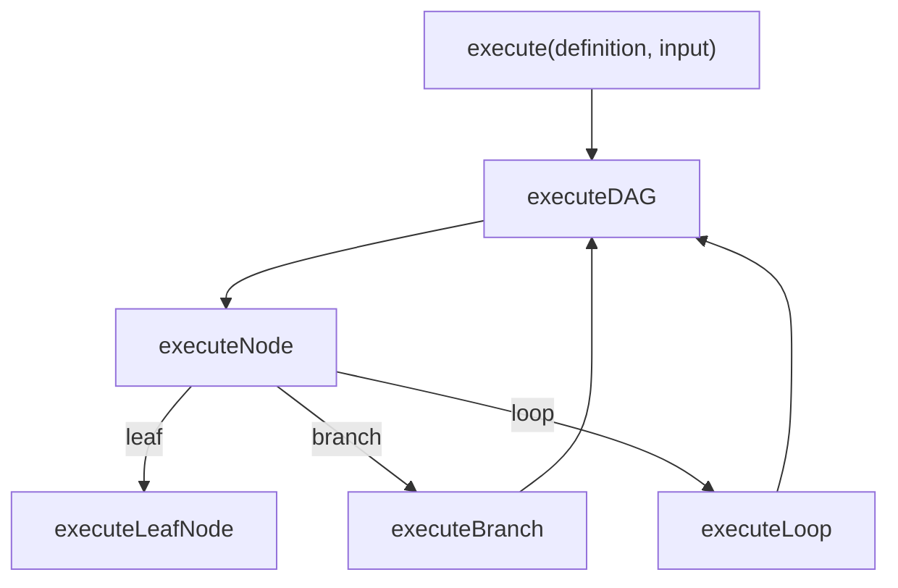

### 4.2 四种执行模式调度流程

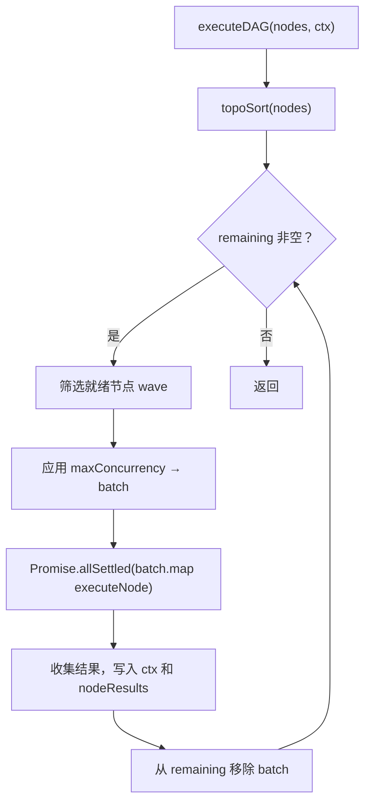

### 4.3 Branch 执行流程

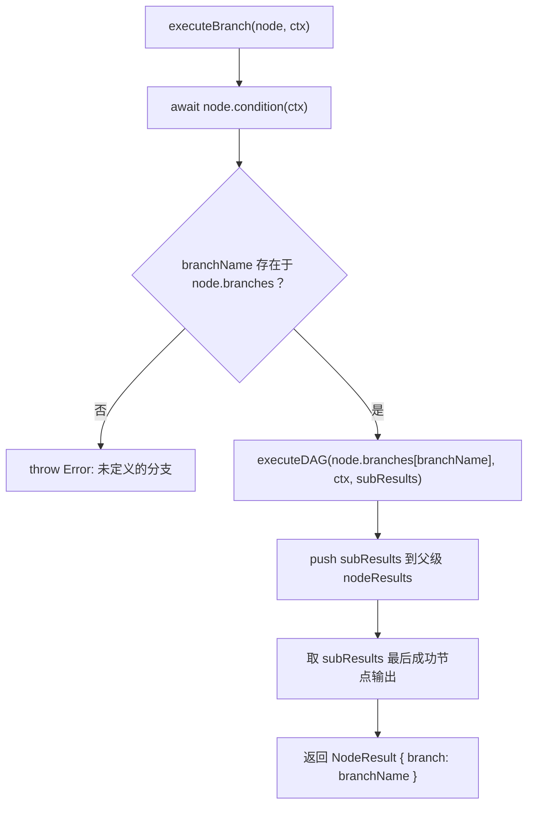

**关键细节**：
- 分支子 DAG 与顶层 DAG 共享同一 `ctx`，分支内节点的输出直接可被顶层后续节点引用
- 分支的内部节点 result 被 `push` 到顶层 `nodeResults`，完整可审计
- branch 节点自身的输出 = 分支最后一个成功节点的输出，写入 `ctx[branchNodeId]`

### 4.4 Loop 执行流程

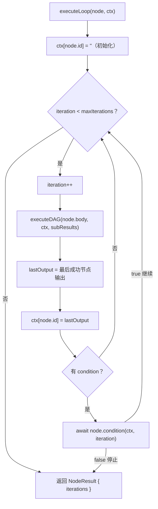

**关键细节**：
- 循环开始前先将 `ctx[node.id]` 初始化为空字符串，使 body 第一次迭代可安全引用 `{loopId}`
- 每轮迭代结束后立即更新 `ctx[node.id]`，确保 condition 函数读取的是最新输出
- body 子 DAG 中的节点 id 在多次迭代中会被覆盖写入 ctx（后轮覆盖前轮），这是预期行为
- loop 节点本身的 durationMs = 所有迭代的累计耗时

### 4.5 插值正则升级

v1.2.x：`/{(\w+)}/g` — 只支持字母数字下划线

v1.3.0：`/{([\w-]+)}/g` — 额外支持连字符，允许节点 id 如 `refine-loop`、`fan-out`

---

## 5. 完整请求生命周期追踪

### 5.1 Branch 场景

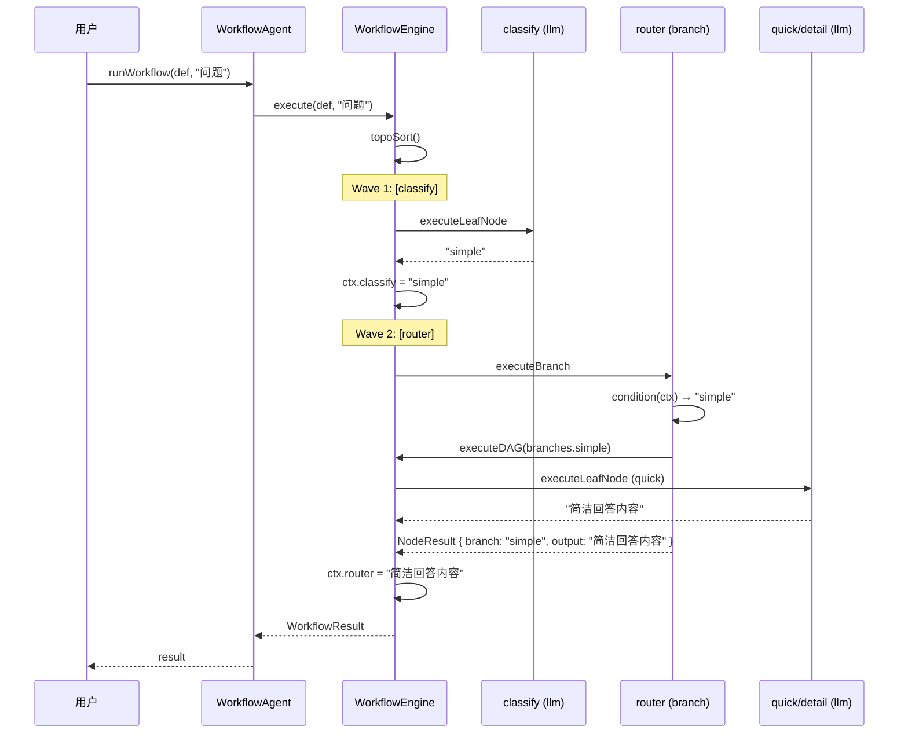

### 5.2 Loop 场景

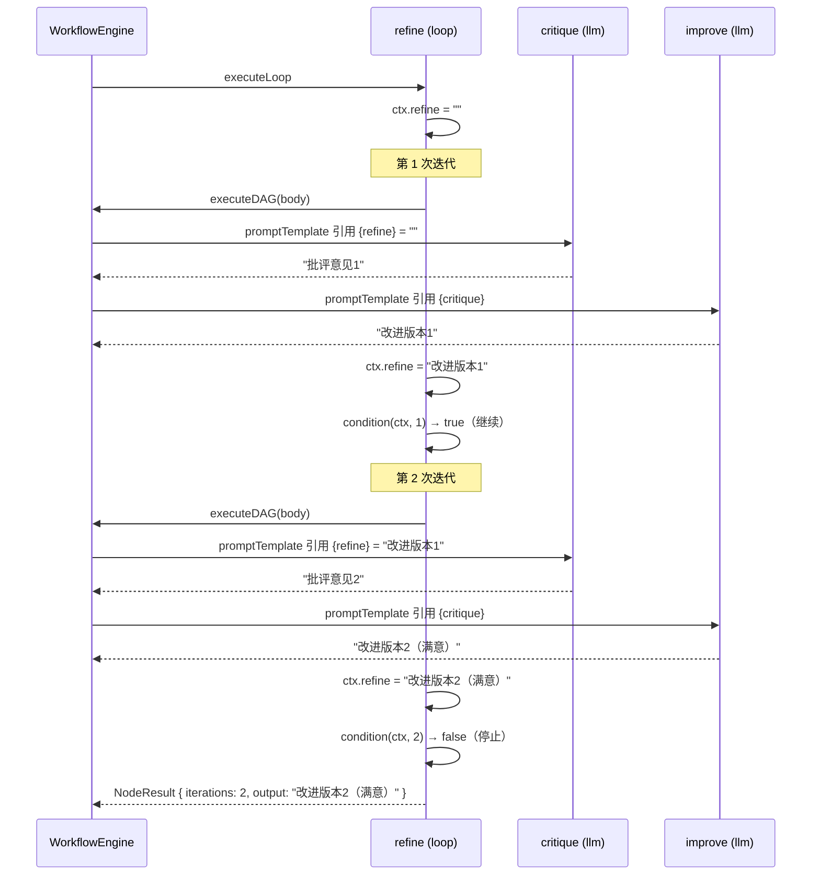

---

## 6. 关键设计决策深度分析

### 6.1 为什么 condition 是函数而非 LLM 节点？

- **背景**：分支和循环的判断逻辑可以很复杂
- **优点**：TypeScript 函数可以解析 LLM 输出（JSON、关键词）、调用外部服务、做数值比较，无限灵活
- **缺点**：需要开发者编写代码，不像纯声明式那样无代码
- **结论**：`fn` 节点已承担「自定义逻辑」职责；condition 作为函数与之一致，且比额外引入一个 LLM 调用更轻量

### 6.2 为什么子 DAG 共享外层 ctx 而非创建隔离副本？

- **背景**：branch/loop 的子节点需要访问上游节点的输出
- **优点**：子节点可直接通过 `{nodeId}` 引用顶层任意节点输出，数据流清晰
- **缺点**：子节点写入 ctx 的 key 与顶层命名空间共享，需注意 id 冲突
- **结论**：工作流的 context 本身就是全局共享数据总线，隔离会破坏数据流设计哲学

### 6.3 为什么 Loop 选择 do-while 而非 while 语义？

- **背景**：两种语义的区别在于 condition 首次求值时机
- **优点**：do-while 保证 body 至少执行一次，符合「先生成再评估」的 AI 工作流直觉（先生成内容，再判断是否满意）
- **缺点**：无法在执行前就跳过循环（如已有足够好的初始输入）
- **结论**：AI 生成场景几乎总需要至少一次执行；需要跳过时可在 body 第一个节点用 `fn` 做前置判断

### 6.4 为什么 loop body 的节点 id 在多轮迭代中被覆盖？

- **背景**：每次迭代执行相同的 body 节点（id 相同）
- **优点**：最新一轮的输出总是可通过 `{nodeId}` 引用，无需维护轮次前缀
- **缺点**：无法直接访问历史轮次的中间输出
- **结论**：工作流关注最终结果而非中间历史；需要历史时可在 `fn` 节点内自行积累到 ctx 中

---

## 7. 可靠性与降级机制

| 失败点 | 降级策略 | 实现位置 |
|---|---|---|
| branch condition 返回未知分支名 | 立即抛出错误，列出可用分支 | `executeBranch()` |
| branch condition 抛出异常 | 被 `executeNode` 的 try/catch 捕获，节点标记 failed | `executeNode()` |
| loop body 某节点失败 | 记录错误，lastOutput 保留上一轮值，循环继续 | `executeLoop()` + `executeDAG()` |
| loop condition 抛出异常 | 被 `executeLoop` 内的 await 捕获，循环中止 | `executeLoop()` |
| loop 超过 maxIterations | 正常停止，不抛出错误，verbose 模式下打印日志 | `executeLoop()` |
| 嵌套 DAG 存在循环依赖 | `topoSort()` 检测并抛出错误 | `topoSort()` |
| 单节点执行超时 | 不内置超时，建议在 `fn` 节点或 tool 内处理 | 用户负责 |

**整体降级哲学**：配置错误（引用不存在的节点、未知分支名）快速失败；运行时错误局部隔离，不扩散到整个工作流；所有执行结果通过 `nodeResults` 完整暴露，方便上层监控和告警。

---

## 8. 当前局限与演进路径

### 局限

| 限制 | 描述 | 影响范围 |
|---|---|---|
| loop body 节点 id 多轮共用 | 无法访问历史迭代的中间输出 | 需要历史追踪的场景 |
| branch 只能选一条分支 | 不支持多分支并发执行后合并 | 多路 A/B 测试场景 |
| loop body 无法访问迭代次数 | condition 有 iteration 参数，但 body 内节点没有 | 需要轮次感知的 body 节点 |
| context 值只能是 string | 结构化数据需手动序列化 | 复杂数据流场景 |

### 演进方向

| 方向 | 实现思路 | 优先级 |
|---|---|---|
| loop body 注入 `{__iter}` 变量 | executeLoop 执行前将 `ctx.__iter = String(iteration)` | 高 |
| 节点重试机制 | `BaseNode` 增加 `retry?: number`，executeNode 捕获后循环 | 高 |
| parallel branch（多路并发） | 新增 `type: "parallel-branch"` 节点，所有分支并发执行后 merge | 中 |
| 持久化快照 | loop 每轮结束后序列化 ctx 到 KV store，支持断点续跑 | 中 |
| 可观测性增强 | loop nodeResults 记录每轮 subResults，branch 记录未选分支的元数据 | 低 |

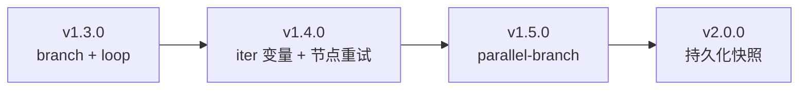

---

## 附录：快速参考卡

### 选型决策

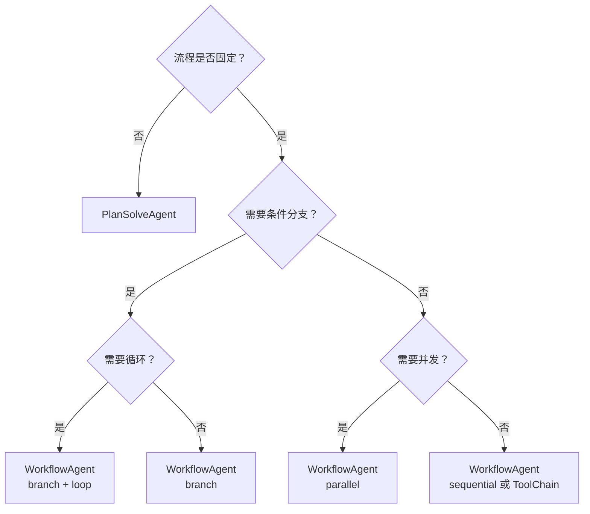

### 六种节点速查

| 节点类型 | 关键字段 | 典型用途 |
|---|---|---|
| `tool` | `toolName`, `inputTemplate` | 调用搜索、数据库、外部 API |
| `llm` | `promptTemplate`, `systemPrompt?` | LLM 生成、分析、翻译 |
| `fn` | `executor(ctx, llm, registry)` | 自定义逻辑、数据转换、聚合 |
| `passthrough` | `sourceKey?` | 透传上游输出，无处理 |
| `branch` | `condition(ctx)`, `branches` | 条件路由、A/B 分支、错误处理 |
| `loop` | `body`, `condition?`, `maxIterations?` | 迭代优化、重试、批处理 |

### NodeResult 字段速查

| 字段 | 类型 | 说明 |
|---|---|---|
| `nodeId` | `string` | 节点 id |
| `status` | `"done" \| "failed"` | 执行状态 |
| `output` | `string` | 节点输出 |
| `error` | `string?` | 失败原因 |
| `durationMs` | `number` | 执行耗时（ms）|
| `iterations` | `number?` | loop 节点：实际迭代次数 |
| `branch` | `string?` | branch 节点：实际执行的分支名 |

### 常见错误与修复

| 错误信息 | 原因 | 修复 |
|---|---|---|
| `返回了未定义的分支 "xxx"` | condition 返回值不在 branches 中 | 检查 condition 返回值与 branches key 是否一致 |
| `存在循环依赖` | 子 DAG 内节点 depends 形成环 | 检查 branch/loop body 内的 depends 配置 |
| `类型为 tool 但未提供 ToolRegistry` | branch/loop body 内有 tool 节点但未传 registry | 构造 WorkflowAgent 时传入 registry |
| loop body 节点输出为空 | body 内所有节点均失败 | 检查 body 节点配置，开启 verbose 查看详细日志 |
